### H2 tehtävä

# Aloitustilanne
- Virtualisoitu VirtualBox 7.0.4
- Käyttöjärjestelmänä Debian GNU/Linux 11 (bullseye) x86-64 arkkitehtuuri 
- Tietokoneessa OS Win 10 pro 
- Aloitetaan 18:55 22/01/2023

# Tiivistelmä  
Ensimmäinen tehtävä on tiivistää https://terokarvinen.com/2020/command-line-basics-revisited/?fromSearch=command%20line%20basics%20revisited sivun sisältö muutamalla
ranskalaisella viivalla.

- Komentoriviä on käytetty jo ennen internetiä ja se on olennainen sekä käytännöllinen osa linuxin käyttöä
- Yleisesti ottaen komentoja ajettaessa varoituksia ei tule, mikäli mitään ei "näy" tapahtuvan, komento on todennäköisesti ajettu onnistuneesti.
- Lähtökohtaisesti kaikki komennot ajetaan vähimmillä oikeuksilla, kirjoitettaessa "sudo" komennon eteen ajetaan komento täysillä oikeuksilla.
- Ohjelmat asennetaan komentoriviä käyttäen valmiina paketteina, toisin kuin esim windowsissa.
- Muuta tietoa ja komentoja voi tarvittaessa tarkastella aikaisemmasta linkistä tai etsimällä netistä.

# H2

19:30 Aloitin asentamalla micro:n kirjoittamalla "sudo apt-get install micro" ja kirjoittamalla "y" pyydettäessä. Annoin asennuksen hoitaa itsensä loppuun ja kirjoitin komentoriville "micro", varmistin näin että asennus on onnistunut ja ohjelma toimii. 

19:33 Koitin listata koneen raudan komennolla "sudo lshw -short -sanitize", tämä ei toiminut sillä lshw ei ollut asennettuna, asensin sen komennolla "sudo apt-get install lshw"
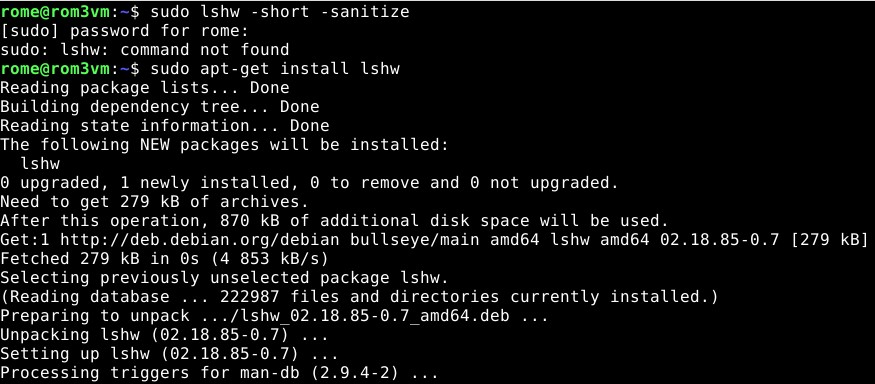

19:38 Asennuksen valmistuttua tarkistin ohjelman toimivan kirjoittamalla komennon "sudo lshw -short -sanitize" uudelleen. Tällä kertaa komento toimi odotetusti.
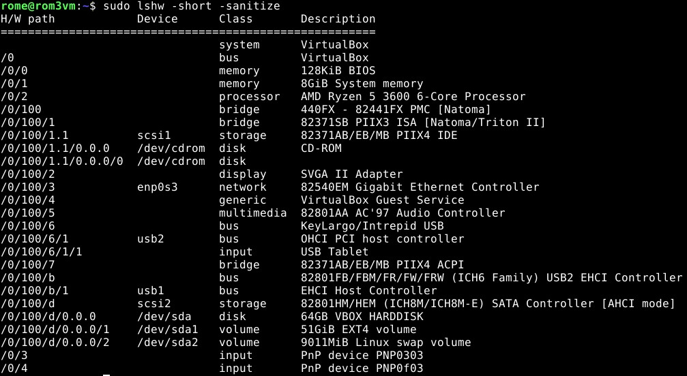
LSHW listaa tietokoneen raudan (muisti, usb-laitteet, näyttö tms.) ja kategorioi ne. Tietoja voidaan käyttää ongelmien selvityksessä ja niistä voin tarvittaessa hakea lisää tietoa.

19:44 Asensin 3 valitsemaani ohjelmaa, ohjelmat jotka valitsin olivat git, tree ja nano. Ennen ohjelmien asentamista muistin pakettien päivityksen olemassa olon ja ajoin sen komennolla "sudo apt-get update" tuo olisi mieluummin pitänyt tehdä aikaisemmin ennen LSHW:n asentamista, mutta parempi myöhään kuin ei milloinkaan 🙂.
Asensin ohjelmat komennolla "sudo apt-get install git tree nano -y". Kaikki onnistui ongelmitta.
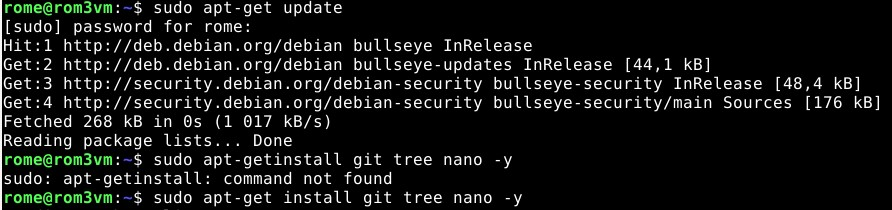

## Git
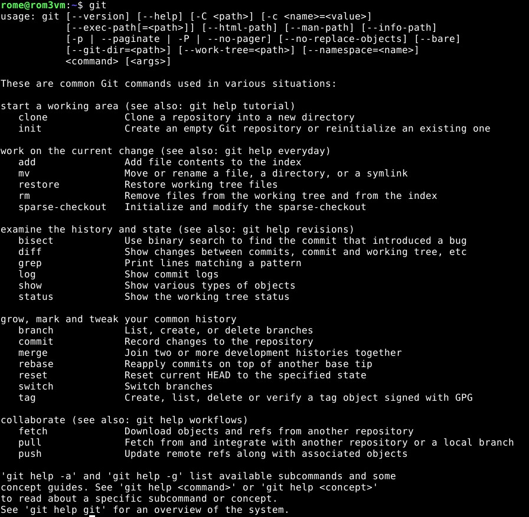

19.50 Git on yleispätevä avoimen lähdekoodin versionhallintaohjelma, käytännössä GITillä on muitakin käyttömahdollisuuksia (kuten tämä raportti itsessään todistaa)

## Nano
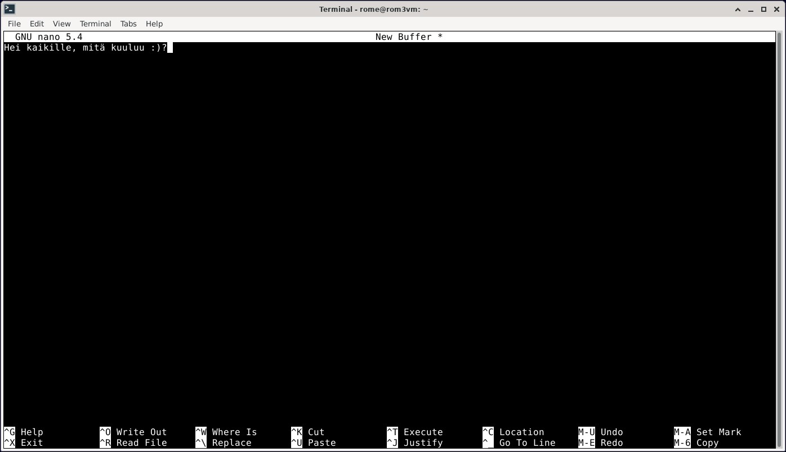

19.59 Nano on tekstieditori jonka tarkoituksena on olla mahdollisimman helppokäyttöinen ja tarjota vain välttämättömät toiminnot.

## Tree
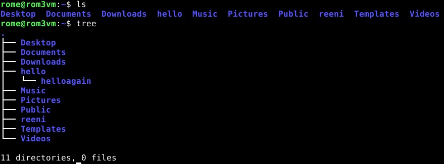

20.07 Tree on ohjelma joka listaa alemmat luettelot (directory) rekursiivisesti (recursive) tarkoittaen, että luettelojen sisäiset luettelot listataan myös. Tree EI listaa ylempänä olevia luetteloja. Tree on myös mielestäni selkeämpi kuin ls (huomattakoon että komennot eivät suoranaisesti ole verrattavissa tai yritä tehdä samaa). Kuvasta nähdään miten "ls" komento listaa luettelon "hello", mutta ei sen alla olevaa "helloagain" luetteloa. 

## Tärkeät luettelot
20.18 Aloitellaan tämä osio

### Root 
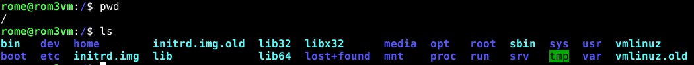
20:20 Ylin kansio koko järjestelmässä, sisältää kirjaimellisesti kaiken.

### Home

20:23 Home on toiseksi ylin kansio, joka sisältää kaikkien käyttäjien omat kansiot. 

### Käyttäjän kansio
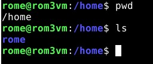
20:24 Käyttäjän oma kansio (Ei yhtenäistä nimeä, kuvassa /rome/) sisältää käyttäjän kansiot, ohjelmat ja tiedostot. 

### Etc
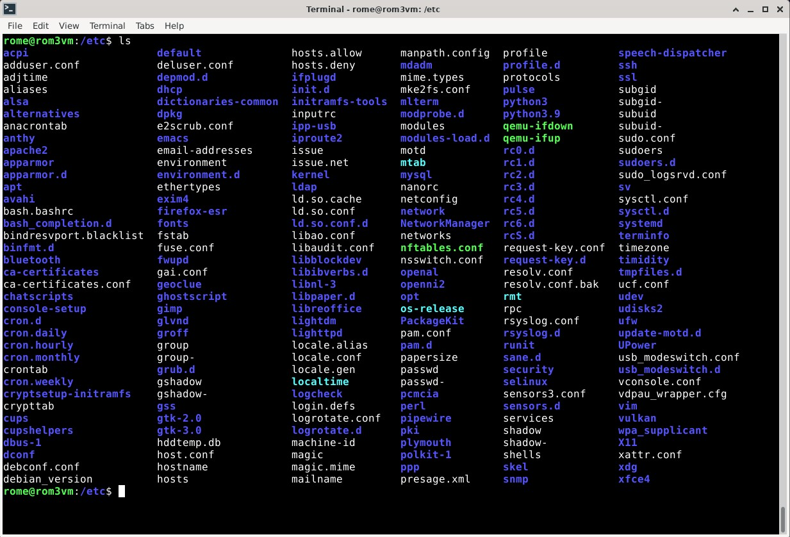
20:26 Etc on kansio jossa kaikki konfiguraatioihin liittyvät tiedostot ovat. Asetuksia toimintaan liittyen. Tiedostoja on monia, käyttäjän, version ja ohjelmistojen tietoja löytyy etc-kansiosta.

### Media
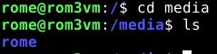
Mediasta löytyy ulkoiset kovalevyt ja cdasemat.

### var/log
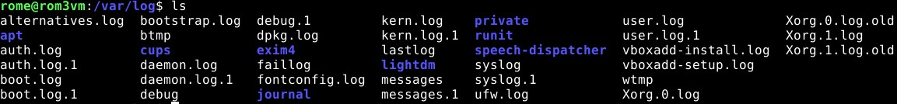
var/log sisältää loegja, eli kirjauksia tapahtumista. User.log esimerkiksi näyttää kirjauksia käyttäjän toiminnasta. 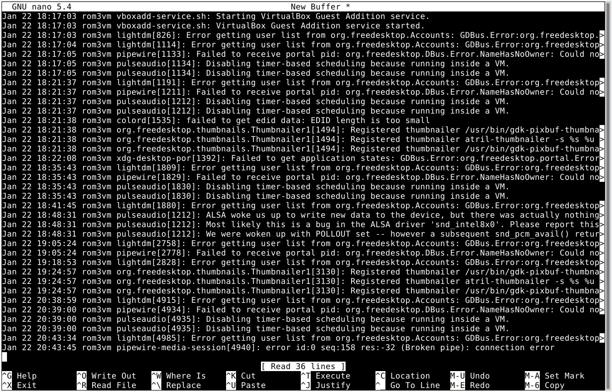

