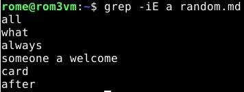
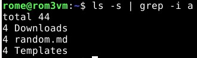

# H3 tehtävä - Vapaus!

### Sisällysluettelo

- [Aloitustilanne](#Aloitustilanne)
- [Tiivistelmä](#tiivistelmä)
- [Kolmen ohjelman lisenssit](#kolmen-ohjelman-lisenssit)
  - [Git](#git)
  - [Nano](#nano)
  - [Nethack](#nethack)
- [Säännöllistä](#säännöllistä)
- [Pipe](#pipe)
- [Loppu](#loppu)
- [Lähteet](#lähteet)

# Aloitustilanne

- Aloitetaan 18:23 24/01/2023

### Virtualisointi
- Virtualisoitu VirtualBox 7.0.4
- Käyttöjärjestelmänä Debian GNU/Linux 11 (bullseye) x86-64 arkkitehtuuri 
- 8GB RAM
- 60GB dynaamista muistia (NVMe SSD)
- 2 Corea Ryzen 5 3600 6-core

### "Host" kone
- Win 10 pro x64
- Ryzen 5 3600 6-core
- GPU RTX 3060
- Ram 16GB
- SSD 1 NVMe (~500GB)
- SSD 2 SATA (~500GB)

# Tiivistelmä  

Aloitetaan 18:30

Ensimmäinen tehtävä on tiivistää muutamalla ranskalaisella viivalla https://www.gnu.org/philosophy/free-sw.html sekä http://lib.tkk.fi/Diss/2005/isbn9529187793/isbn9529187793.pdf (sivut 113-121).

- "Vapaakäyttöinen" tarkoittaa, että käyttäjillä on vapaus **Ajaa, opiskella ja muuttaa, jakaa ohjelmaa sekä jakaa muokattua ohjelmaa**. 
- On huomattavaa, että englanniksi **"Free"** tarkoittaa vapaakäyttöistä, ei ilmaista.
- _Käyttäjän_ merkitys mielessä, ei niinkään _kehittäjän_.
- Myös kaupallinen käyttö on sallittua.
- Ohjelmaa on kyettävä ajamaan vapaasti ilman rajoituksia.
- Ohjelman hyödyttömyys/rikkinäisyys ei automaattisesti tarkoita, etteikö ohjelma olisi vapaakäyttöinen. Mikäli ohjelmaa on tahallisesti muutettu niin, ettei sen vapaa käyttö onnistu, kyseessä **EI** ole vapaakäyttöinen ohjelma.
- Alussa esim. CD-levyjen kanssa kopimisen estämiseen käytetyt keinot vaikeuttivat niiden kuuntelua, mutta eivät estäneet CD:n kopiointia.
- "Toistaiseksi (2005)" on aina löytynyt taitavia henkilöitä kiertämään suojaukset. (Nykyään 2023 luvulla DENUVO on käytetty antipiraatti-sovellus jonka murtaminen on haastavaa ja ongelmallista. Henkilö nimeltä "Empress" on toimittanut murrettuja kopioita peleistä, joissa on käytetty DENUVOa, mutta versiot saattavat pyöriä hitaammin tai hajota ajan kuluessa **EI OSA TIIVISTELMÄÄ**).
- Immateriaaliin viittavat lait ovat usein tulleet muiden lakien jäljessä.

# Kolmen ohjelman lisenssit
Aloitetaan 19:07

## Git

Aloitetaan 19:13

- Mitä lisenssiä kyseinen ohjelma käyttää? 

GNU General Public License version 2.0

- Mistä päättelit lisenssin?

Googlasin ja löysin vastauksen linkistä https://git-scm.com/about/free-and-open-source 

- Onko kyseessä vapaa lisenssi?

Kyllä.

- Mitkä ovat tämän lisenssin tärkeimmät oikeusvaikutukset?

Lisenssi tekee ohjelmasta vapaakäyttöisen, mutta määrittää että mikäli ohjelmaa käytetään jossain täytyy lisenssi säilyttää siitä juontuviin ohjelmiin.

- Jääkö tämän ohjelman lisenssoinnista jotain avoimia kysymyksiä tai epäselvyyttä?

Jos käytetään aikasempaa versiota lisenssistä jota on tuotannon aikana päivitetty säilytetäänkö vanha lisenssi tuotteessa vai voidaanko se päivittää lisenssin uusimpaan versioon (tässä tapauksessa versiosta 2 versioon 3) 

## Nano

Aloitetaan 19:19

- Mitä lisenssiä kyseinen ohjelma käyttää? 

GNU General Public License

- Mistä päättelit lisenssin?

Googlasin ja löysin vastauksen linkistä https://en.wikipedia.org/wiki/GNU_nano#:~:text=Unlike%20Pico%2C%20nano%20is%20licensed,the%20GNU%20Project%20in%202001.

- Onko kyseessä vapaa lisenssi?

Kyllä

- Mitkä ovat tämän lisenssin tärkeimmät oikeusvaikutukset?

Copyleft periaatteella sovellusta saa käyttää vapaasti. Mikäli sitä käytetään kaupallisesti tuotteen on säilytettävä sama lisenssi

- Jääkö tämän ohjelman lisenssoinnista jotain avoimia kysymyksiä tai epäselvyyttä?

Jos käytetään aikasempaa versiota lisenssistä jota on tuotannon aikana päivitetty säilytetäänkö vanha lisenssi tuotteessa vai voidaanko se päivittää lisenssin uusimpaan versioon (tässä tapauksessa versiosta 1 versioon 3)

## Nethack

### Tässä kohtaa ymmärsin että asentamani "tree" ei ollutkaan sovellus, vaan komento. En löytänyt mitään lisensoinnista siihen liittyen, joten vaihdoin sovellukseen "Nethack" joka vaikuttaa todella syvältä (in-depth) peliltä.

Aloitetaan 19:27 (tauko 19:34-19:50)

- Mitä lisenssiä kyseinen ohjelma käyttää?

Nethack käyttää omaa lisenssiä, nimeltä "Nethack GPL"

- Mistä päättelit lisenssin?

Googlasin ja löysin nethackin kotisivulta "license" kohdasta https://www.nethack.org/common/license.html selityksen.

- Onko kyseessä vapaa lisenssi?

Ei

- Mitkä ovat tämän lisenssin tärkeimmät oikeusvaikutukset?

Sovellusta saa kopioida, jakaa ja muokata, mikäli tiedostoissa olevat tekijänoikeuksiin, lisenssiin ja takuuseen koskevat tiedot säilytetään ja lisenssi toimitetaan ohjelman saajille.

- Jääkö tämän ohjelman lisenssoinnista jotain avoimia kysymyksiä tai epäselvyyttä?

Ei

# Säännöllistä

Aloitetaan 19:52

Käytin komentoa 

    grep -iE a random.md  
komento etsii sanoja joissa on iso tai pieni kirjain a tiedostosta nimeltä random.md. 

# Pipe

Aloitetaan 20:10

Käytin komentoa

    ls -s | grep -i a 
    
 komento listaa senhetkisen kansion alla olevat tiedostot lyhyesti ja hakee niistä isoista kirjaimista piittaamatta kerrat joissa kirjain a esiintyy ja kertoo kuinka monta kertaa missäkin tiedostossa.
 
 
# Loppu 

Tehtävä on valmis 20:29, en tehnyt viimeistä vapaavalintaista tehtävää. Olisin lähes minkä tahansa muun tehtävän tehnyt, mutta olen julistanut henkilökohtaisen sodan REGEXiä vastaan, vihaan sen kirjoittamista ja toivon voivani välttää sen kirjoittamisen tulevaisuudessa. Mikäli joudun sitä kirjoittamaan koitan etsiä vaihtoehtoisia keinoja. Viha perustuu muistaakseni ohjelmointi1-kurssilla tehtävään ohjelmaan joka antoi salasanalle tietyt vaatimukset ja tarkasti sen toiminnan. 

# Lähteet 
1) https://www.gnu.org/philosophy/free-sw.html "What is free software" (luettu 24/1/2023)
2) http://lib.tkk.fi/Diss/2005/isbn9529187793/isbn9529187793.pdf "Rise of open source" (luettu 24/1/2023)
3) https://irdeto.com/denuvo/ "Denuvo" (luettu 24/1/2023)
4) https://www.wired.com/story/empress-drm-cracking-denuvo-video-game-piracy/ "Empress" (luettu 24/1/2023
5) https://git-scm.com/about/free-and-open-source "Git license" (luettu 24/1/2023)
6) https://en.wikipedia.org/wiki/GNU_nano#:~:text=Unlike%20Pico%2C%20nano%20is%20licensed,the%20GNU%20Project%20in%202001. "GNU Nano" (Luettu 24/1/2023)
7) https://www.nethack.org/common/license.html "Nethack license" (luettu 24/1/2023)

