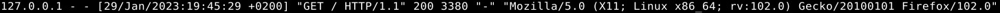

### Sisällysluettelo

- [Aloitustilanne](#Aloitustilanne)
- [Tukki](#Tukki)
- [Aiheuta](#Aiheuta)
- [Lähteet](#lähteet)

# Aloitustilanne

- Aloitetaan 18:33 29/01/2023

### Virtualisointi
- Virtualisoitu VirtualBox 7.0.4
- Käyttöjärjestelmänä Debian GNU/Linux 11 (bullseye) x86-64 arkkitehtuuri 
- 8GB RAM
- 60GB dynaamista muistia (NVMe SSD)
- 2 Corea Ryzen 5 3600 6-core

### "Host" kone
- Win 10 pro x64
- Ryzen 5 3600 6-core
- RTX 3060
- Ram 16GB
- SSD 1 NVMe (~500GB)
- SSD 2 SATA (~500GB)

# Tukki

18:36

Saimme tehtäväksi https://terokarvinen.com/2023/linux-palvelimet-2023-alkukevat/#h4-tukki analysioida yhden rivin neljästä eri lokista. Tutkin kaikkia samalla komennolla, muuttaen tiedostosijaintia lopussa (esimerkissä x)

    sudo cat x (x tarkoittaa lokin nimeä, joka muuttuu)

1) /var/log/syslog

Valitsin kohdan Jan 29 18:35:12 rom3vm systemd[1]: run-user-117.mount: Succeeded

Loki on tapahtunut Tammikuun 29 päivä klo 18:35, järjestelmän nimi on "rom3vm" ja viesti ilmoittaa että käyttäjä ID:llä 117 on "mountattu" (mounttaus tarkoittaa, että tiedoston käyttö mahdollistetaan käyttäjälle)

2) /var/log/auth.log

Valitsin kohdan Jan 29 18:34:55 rom3vm lightdm: pam_unix(lightdm-greeter:session): session opened for user lightdm(uid=117) by (uid=0)

Tämä tarkoittaa että 29 tammikuuta 18:34 järjestelmä nimeltä rom3vm käynnist LIGHTDM:än. Lightdm on ohjelma joka piirtää käyttöliittymän käyttäjälle. Tämä sessio LightDM:ssä avattiin käyttäjälle jonka UID on 117 käyttäjän jonka UID on 0 toimesta. UID 0 on "superuser" eli /root/ käyttäjä. Tällä käyttäjällä on eniten (kaikki) oikeuksia ja voi tehdä mitä tahansa, SUDO ajaa ohjelmia tämän "käyttäjän" oikeuksilla

3) /var/log/apache2/access.log
 
En päässyt tutkimaan mitään ennen kuin käynnistin apachen komennolla 

    $sudo systemctl start apache2.service

Tämän käynnistyttyä avasin selaimen ja kirjoitin hakukentään localhost, aiheutin lokeja kirjoittamalla hakukenttään localhost/x, jossa x on eri sanoja.

Valitsin lokin 127.0.0.1 - - [29/Jan/2023:19:09:25 +0200] "GET /moi HTTP/1.1" 404 487 "-" "Mozilla/5.0 (X11; Linux x86_64; rv:102.0) Gecko/20100101 Firefox/102.0"

Lokissa näkyy IP johon selain yhdistää (tässä tapauksessa 127.0.0.1 joka on localhostin IP). Lokissa näkyy tämän jälkeen ajankohta jolloin toiminto tehtiin, sekä aikavyöhyke. Tämän jälkeen lokista löytyy toiminto joka ajettiin (GET /(MOI)) joka viittaa localhost/moi linkissä käymiseen, seuraavaksi lukee virhekoodi jonka selain palautti (404, ei löytynyt pyydetty asiaa/resurssia tms.) 487 tarkoittaa tiedon määrää tavuina (byte). Lopuksi logista löytyy käyttöjärjestelmän ja selaimen tietoja, kuten versio.

4) /var/log/apache2/error.log

Pääsin suoraan tutkimaan lokia komennolla

  
Valitsin lokin [Sun Jan 29 18:34:54.798735 2023] [mpm_event:notice] [pid 972:tid 139752171171136] AH00489: Apache/2.4.54 (Debian) configured -- resuming normal operations 

Ensimmäisenä jälleen kerran löytyy tietoa siitä milloin loki tapahtui, viikonpäivää, kellonaikaa ja vuotta myöten. [mpm_event:notice] tarkoittaa lokin "tasoa" tässä tärkeä sana on "notice", joka tarkoittaa ilmoitusta. [pid 972:tid 139752171171136] on tunnistukseen liittyvä merkkijono joka ei ole merkittäväm tehtävän kannalta ja jonka tarkkaa tarkoitusta en tiedä, tarvittaessa tuo auttaa identifioimaan tapahtumia tarkemmin. AH00489 on virhekoodi kyseiselle viestille ja sitä seuraava merkkijono on apachen versio. Viimeinen viesti configured -- resuming normal operations on helposti ihmisen ymmärrettävä tilannepäivitys serverin tilanteesta.

# Aiheuta

19:17

Aiheutin var/log/apache2/access.log:iin epäonnistuneen tapahtuman kirjoittamalla selaimeen localhostin perään /aiheutan lokiin tapahtuman. Tämä ei onnistu sillä tuosta osoitteesta ei löydy mitään palautettavaa tietoa.

loki 127.0.0.1 - - [29/Jan/2023:19:31:23 +0200] "GET /aiheutan%20lokiin%20tapahtuman HTTP/1.1" 404 488 "-" "Mozilla/5.0 (X11; Linux x86_64; rv:102.0) Gecko/20100101 Firefox/102.0" on se jonka aiheutin. Tässä lokissa alussa näkyy ip, joka on tietokoneen lokaali ip, sen jälkeen näkyy ajankohta jolloin lokikirjaus on tapahtunu, sitten komento (get) ja syöte joka linkin perään on kirjoitettu. 404 tarkoittaa selaimen palauttamaan virheilmoitusta ja 488 tavujen määrää jonka verran tietoa on tullut. Lopussa näkyy selaimen ja käyttöjärjestelmän versiot.

Aiheutin lokiin onnistuneen kirjauksen avaamalla selaimen localhost sivun.

127.0.0.1 - - [29/Jan/2023:19:45:29 +0200] "GET / HTTP/1.1" 200 3380 "-" "Mozilla/5.0 (X11; Linux x86_64; rv:102.0) Gecko/20100101 Firefox/102.0"
Alussa näkyvä sarja tarkoittaa IP:tä josta loki on tehty, tämä on tietokoneen oma paikallinen ip. Sen jälkeen näkyy tietoa siitä milloin lokikirjaus on tehty (+0200 tarkoittaa aikaa tunteina jonka tietokone on jäljessä UTC:sta). Seuraavaksi näkyy komento joka selaimelle on annettu (get /) ja statuskoodi(200) jonka selain on palauttanut, 3380 tarkoittaa tiedon määrää joka tavuina on palautettu. Lopuksi löytyy tietoa selaimen ja käyttöjärjestelmän versiosta.

# Tiivistelmä
 20:00
Valitsin tehdä tiivistelmän seuraavasta artikkelista ja kommenteista https://jvns.ca/blog/2022/04/12/a-list-of-new-ish--command-line-tools/

- On paljon komentoja jotka ovat hyödyllisiä, niillä voidaan korvata olemassaolevia komentoja tai ne voivat olla täysin uusia.
- Yhtenä esimerkkinä ripgrep joka tekee saman asian kuin grep mutta ei huomioi esim. piilotettuja tiedostoja. Ripgrep on tehokkaampi kuin grep ja sillä voi etsiä useita malleja noudattaen.
- Toinen hyvä esimerkki on tldr jolla korvataan man, se palauttaa huomattavasti helpommin luettavan, mutta saman tiedon sisältävän tulosteen. 
[!add file: upload](Viikko2Kuvat2/v2t2k4.jpg)
- Kommenteissa käyttäjät kertoivat muita esimerkkejä komennoista jotka ovat hyödyllisiä mutta eivät yhtä tunnettuja.

Tehtävä on valmis 20:18

# Lähteet 
(kaikki luettu 29/1/2023)
1) https://terokarvinen.com/2023/linux-palvelimet-2023-alkukevat/#h4-tukki
2) https://en.wikipedia.org/wiki/LightDM 
3) https://embracethered.com/blog/posts/2021/linux-user-uid-zero-backdoor/#:~:text=On%20Unix%2FLinux%20users%20with,or%20group%20identifier%20to%20zero.
4) https://jvns.ca/blog/2022/04/12/a-list-of-new-ish--command-line-tools/
5) https://tldr.sh
