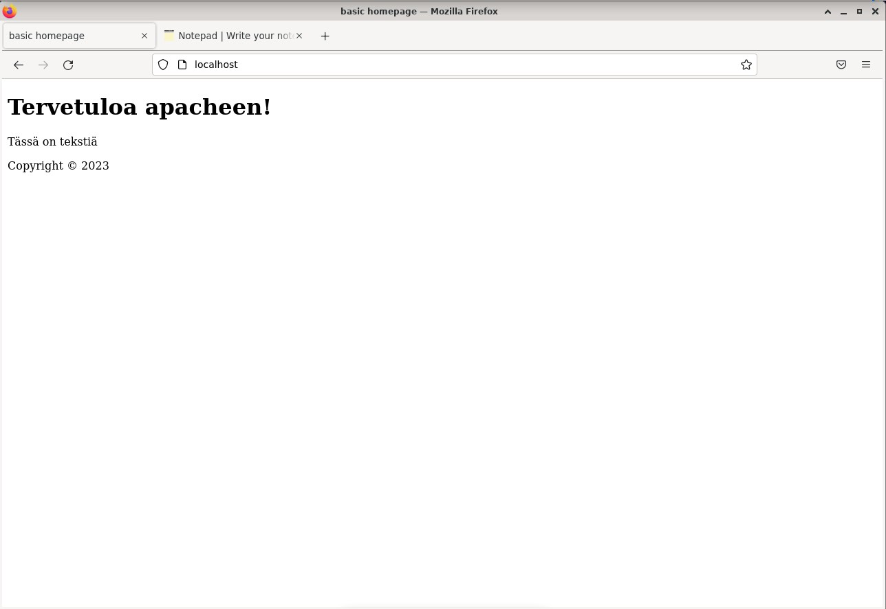
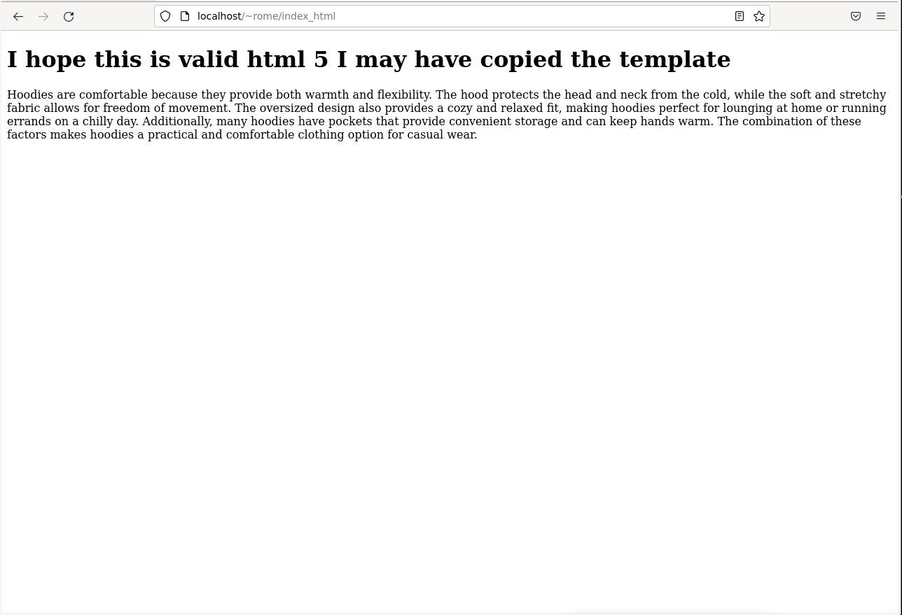

### Sisällysluettelo

- [Aloitustilanne](#Aloitustilanne)
- [Tiivistelmä](#Tiivistelmä)
- [Esimerkkisivu](#esimerkkisivu)
- [Käyttäjän sivut](#käyttäjän-sivut)
- [Uusi käyttäjä kotisivuilla](#Uusi-käyttäjä-kotisivuilla)
- 
- [Lähteet](#lähteet)


# Aloitustilanne

- Aloitetaan 14:40 1/2/2023

### Virtualisointi
- Virtualisoitu VirtualBox 7.0.4
- Käyttöjärjestelmänä Debian GNU/Linux 11 (bullseye) x86-64 arkkitehtuuri 
- 8GB RAM
- 60GB dynaamista muistia (NVMe SSD)
- 2 Corea Ryzen 5 3600 6-core

### "Host" kone
- Win 10 pro x64
- Ryzen 5 3600 6-core
- RTX 3060
- Ram 16GB
- SSD 1 NVMe (~500GB)
- SSD 2 SATA (~500GB)


# Tiivistelmä
Saimme tehtäväksi kuunnella yhden jakson Indie Hacker podcastistä https://share.transistor.fm/s/940ae75e ja tiivistää sen parilla ranskalaisella viivalla. Valitsin jakson henkilöstä Mat De Sousa (uusin jakso).

- Jakso käsittelee Mat De Sousa:n matkaa omien sanojensa mukaan keskivertoisesta php-koodaajasta $37k/kk shopify sovellusten luojaksi.
- Hän aloitti yksin ja palkkasi asiakaspalvelijaksi 6kk päästä yhden henkilön, lopussa tiimiin kuuluu 5 henkilöä.
- Ei tarvitse olla paras devaaja saadakseen jotain toimivaa ja myytävää valmiiksi.
- Kaikki alkoi kahden henkilön pyynnöstä luoda sovellus, Sousa ei itse uskonut sovelluksen toimivan mutta loi sen kuitenkin ja sitä kautta huomasi pystyvänsä oikeasti luomaan sovelluksia. Ensimmäinen sovellus pystähtyi $1K/kk. Shopify lopuksi muutti asioita alustalla ja se jouduttiin sulkemaan.
-  Sousan kaikki sovelluksen jotka hän loi eivät saaneet käyttäjiä.
-  Hän aloitti luomalla prototyypin photoshopissa, jota hän käytti palautteen saamiseen ja kysyi mitkä asiakkaat haluaisivat muuttaa sovelluksessa. Hän käytti noin viikon sovelluksen perus-osan luomiseen ja paranteli sekä korjasi ongelmia.
-  Shopify alustana on hyvä, sillä käyttäjät luottavat siihen jo valmiiksi ja maksutiedot säilyvät (toki käyttäjien niin valitessa) joten myynti on helppoa.


# Esimerkkisivu

Aloitetaan 14:48

Käynnistin virtualisoidun tietokoneen jossa apache oli jo valmiiksi pyörimässä, mikäli se ei olisi ollut olisin voinut sen käynnistää komennolla ```sudo systemctl start apache2```. Tämä ei kuitenkaan nyt ollut tarpeellista. Menin tietokoneen juureen toistamalla komentoa ```cd ..``` kunnes en päässyt sillä kauemmaksi. Kirjoitin seuraavat komennot.

    cd /var/www/html
    
Tarkistin olevani oikeassa paikassa kirjoittamalla ```ls```. Tämän jälkeen avasin index.html tiedoston johon apachen esimerkkikotisivu on tallennettu komennolla 

    sudo micro index.html 
    
Kopioin sieltä löytyvän koodin "online notepad:ille" jotta sain helposti palautettua kotisivun tehtävän jälkeen (koodin sai helposti kopioitua tekstieditorista painamalla ctrl + a, ctrl + c. Googlasin validoidun html 5 templaten ja täytin siihen yksinkertaista sisältöä jonka jälkeen tallensin. Apachen kotisivu näyttää nyt tältä:


Kun yritin palauttaa koodia avaamalla index.html tiedoston jälleen komennolla ```sudo micro index.html``` terminaali oli täysin mustana, komento ```micro index.html``` kuitenkin avasi tiedoston normaalisti, kopioituani koodin takaisin ja tallennettuani (ctrl+s) micro kysyi tahdonko muuttaa tiedostoa sudo-oikeuksilla johon vastasin kyllä, ja salasanan kirjoitettuani tuttu apachen kotisivu oli jälleen paikalla.
        
Mikäli en olisi saanut palautettua sivun ulkonäköä olisin voinut poistaa apachen kaikkine tietoineen ja asentaa sen uudelleen, seuraavilla komennoilla.

    sudo apt-get purge apache2

    sudo apt-get install apache2

    sudo service apache2 start


# Käyttäjän sivut

Aloitetaan 15:26

Loin käyttäjälle public_html directoryn komennolla

        mkdir public_html

Tämän jälkeen menin kansioon ja loin sinne index.html nimisen tiedoston komennolla

        micro index.html
        
Kopioin jälleen html 5 templaten ja pyysin huvikseni chatgpt:tä generoimaan lyhyen tekstin siitä, miksi hupparit ovat mukavia. Tulos oli seuraavanlainen:




# Uusi käyttäjä kotisivuilla

Aloitetaan 15:47


# Lähteet Kaikki luettu 2/1/2023
1) https://terokarvinen.com/2023/linux-palvelimet-2023-alkukevat/#h5-maailman-suosituin
2) https://share.transistor.fm/s/940ae75e
3) 
