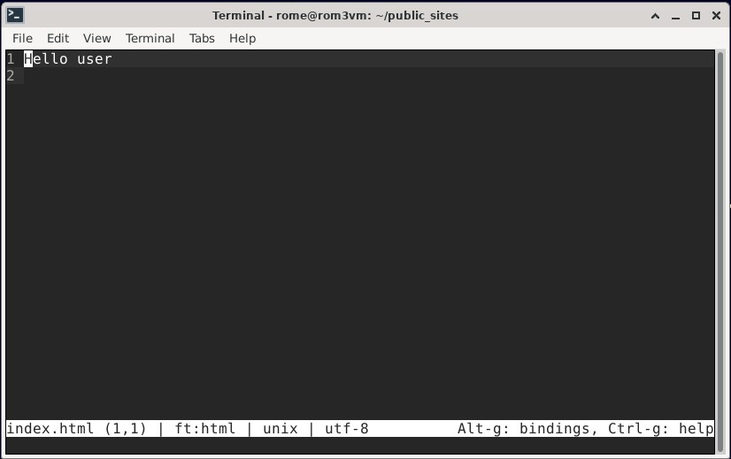
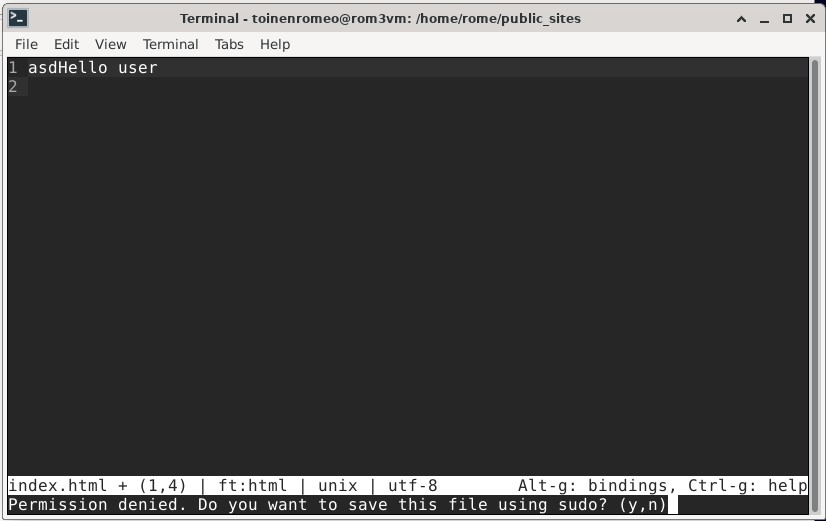
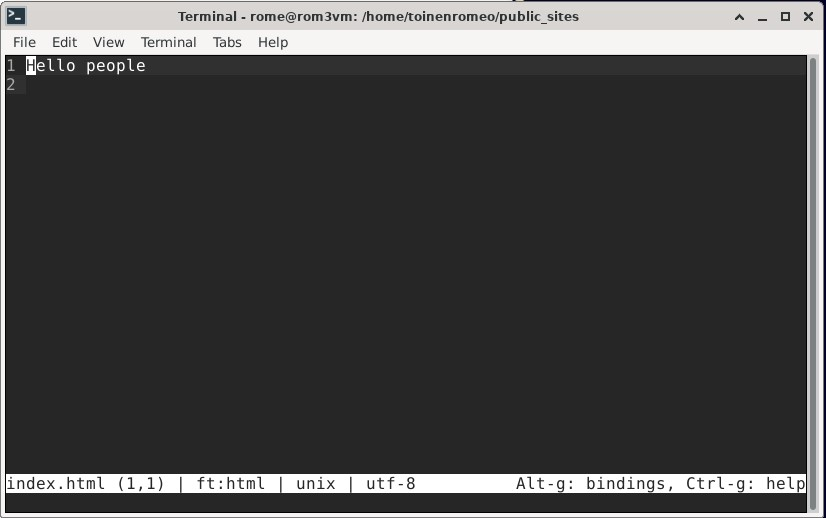
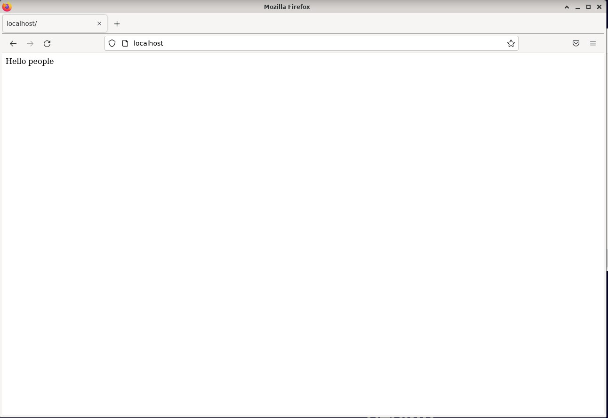
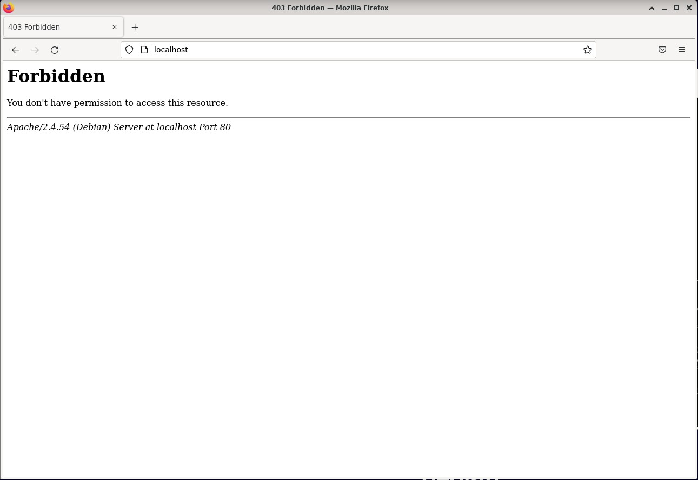

### Sisällysluettelo

- [Aloitustilanne](#Aloitustilanne) 
- [Etusivu](#etusivu)
- [Virhe](#virhe)
- [Tiivistelmä](#Tiivistelmä)
- [Lähteet](#lähteet)


# Aloitustilanne

- Aloitetaan 14:17 5/2/2023

### Virtualisointi
- Virtualisoitu VirtualBox 7.0.4
- Käyttöjärjestelmänä Debian GNU/Linux 11 (bullseye) x86-64 arkkitehtuuri 
- 8GB RAM
- 60GB dynaamista muistia (NVMe SSD)
- 2 Corea Ryzen 5 3600 6-core

### "Host" kone
- Win 10 pro x64
- Ryzen 5 3600 6-core
- RTX 3060
- Ram 16GB
- SSD 1 NVMe (~500GB)
- SSD 2 SATA (~500GB)


## Tiivistelmä löytyy lopusta


# Etusivu 

Aloitetaan 14:34

Muutin apachen etusivun. Aloitin menemällä root kansioon toistamalla komentoa ```cd ..``` kunnes pääsin juurihakemistoon. Kirjoitin komennot

    sudo touch /etc/apache2/sites-enabled/frontpage.conf
    
    sudoedit /etc/apache2/sites-enabled/frontpage.conf

Touch luo tyhjän tekstitiedoston tiettyyn paikkaan ja sudoedit antaa editoida sitä. Kirjoitetaan seuraava tiedostoon.

    <VirtualHost *:80>
	  DocumentRoot /home/rome/public_sites/
	  <Directory /home/rome/public_sites/>
		require all granted
	  </Directory>
    </VirtualHost>

Tuo koodi mahdollistaa sivun muokkaamisen ilman sudoa, palataan siihen myöhemmin. Seuraavaksi laitetaan uusi sivu päälle ja poistetaan vanha oletus käytöstä.

    sudo a2ensite frontpage.conf
    
    sudo a2dissite 000-default.conf
    
Jotta saadaan tieto päivitettyä uudelleenkäynnistetään apache ```sudo systemctl restart apache2``` 

Mennään luomaan sivu konffistiedostossa olevaan osoitteeseen 

    cd /home/rome/ 
    
    mkdir public_sites
    
```micro index.html``` tänne kirjoitetaan html  




Kirjauduin pois pääkäyttäjältä varmistaakseni että sivun muokkaaminen onnistuu ilman sudoa, huomasin että näin ei ole. Ajattelen ongelman johtuvan siitä, että loin tiedostot pääkäyttäjälle. Kuvasta huomaa, ettei toisella käyttäjällä tiedoston muokkaaminen onnistu.




Korjataan asia, kirjaudutaan takaisin pääkäyttäjälle, poistetaan directory sekä index.html tiedosto, muokataan frontpage.conf tiedoston reitti toiselle käyttäjälle ja luodaan tarvittavat kansiot sekä tiedostot oikeaan paikkaan.

    su rome
    
    sudo rm -r public_sites
    
```export EDITOR=micro``` Tämä komento muuttaa istunnon ajaksi sudoeditissä käytettävän editorin microksi. 

    sudoedit /etc/apache2/sites-available/frontpage.conf
    
    
Kirjoitetaan seuraava koodi avattuun konffikseen

    <VirtualHost *:80>
  	DocumentRoot /home/toinenromeo/public_sites/
  	<Directory /home/toinenromeo/public_sites/>
		require all granted
  	</Directory>
    </VirtualHost>

Vaihdetaan käyttäjää uudelleen
  
    su toinenromeo
    
Mennään oikeaan paikkaan
    
    cd /home/toinenromeo/
    
Luodaan directory "public_sites"
    
    mkdir public_sites
    
Mennään oikeaan paikkaan
    
    cd public_sites
    
Luodaan tiedosto "index.html" ja laitetaan sinne sisältöä jonka haluamme sivulla nähdä, kirjoitin vain pari sanaa.
    
    micro index.html
    

    

Tällä kertaa muokkaaminen onnistui ongelmitta ilman sudo-oikeuksia. Lopuksi äynnistetään apache uudelleen 
  
    sudo systemctl restart apache2
        


Kaikki toimii.

Huomattakoon että en ole täysin varma johtuiko ongelma tallentamisen kanssa siitä että tiedosto oli väärässä paikassa vai siitä, että muokkaaja oli toinen käyttäjä. Saatoin käyttää ylimääräistä aikaa turhaan, mutta ainakin tuli kerrattua. 🙂


# Virhe

Aloitetaan 15:43

Luodaan virhe konfiguraatiotiedostoon menemällä tiedostoon ja poistamalla yksi kirjain

    sudoedit etc/apache2/sites-available/frontpage.conf

Tallennetaan seuraava teksti, public_sites -> public

    <VirtualHost *:80>
	  DocumentRoot /home/toinenromeo/public/
	  <Directory /home/toinenromeo/public/>
		require all granted
	  </Directory>
    </VirtualHost>

Käynnistetään apache uudelleen

    sudo systemctl restart apache2



Käydään katsomassa miltä error.log näyttää

    sudo cat var/log/apache2/error.log

Seuraava lokikirjaus löytyy

```[Sun Feb 05 16:09:01.126916 2023] [authz_core:error] [pid 2957:tid 140093529573120] [client 127.0.0.1:33380] AH01630: client denied by server configuration: /home/toinenromeo/public``` Lokissa mainitaan kellonaika, sekä päivämäärä jolloin kirjaus on tehty (juuri äsken), lokin tyyppi (error), prosessin ja säikeen ID, mistä osoitteesta pyyntö on tehty (IP ja portti) ja lopuksi virhekoodi sekä tieto mitä on tapahtunut. 

    sudo apache2ctl configtest
    
Antaa erilaisen, lyhyemmän tulosteen josta selviää ongelman tiedostosijainti. ```AH00112: Warning: DocumentRoot [/home/toinenromeo/public/] does not exist```

Muutetaan lopuksi konffitiedosto takaisin aikaisempaan.


# Tiivistelmä
### https://httpd.apache.org/docs/2.4/getting-started.html

- Ohjeet on tarkoitettu ihmisille jotka ovat täysin uusia apachen käyttäjiä
- Verkon osoitteet esitetään URL-osoitteina ja ne määrittää palvelimen nimi, reitti esim /etc/apache2/error.log ja välillä kysymysmerkin jälkeen tulevilla lisäargumenteilla esim. name=John
- Käyttäjä yhdistyy protokollan mukaisesti ja pyytää resursseja palvelimelta, resurssi voi olla ohjelma, tiedosto tai "käsittelijä" (vaikka status)
- Palvelin lähettää vastauksen, joka koostuu tilakoodista ja tarvittaessa vastauksen rungosta. Tilakoodi kertoo, onnistuiko pyyntö ja, jos ei, mikä virhetilanne oli. Tämä kertoo asiakkaalle, mitä sen tulisi tehdä vastauksella.

### https://httpd.apache.org/docs/current/vhosts/name-based.html

- Ip pohjaiset virtuaalipalvelimet käyttävät yhteyden IP osoitetta päättääkseen mitä tehdä, nimi-pohjaiset puolestaan osoitteen nimeä. IP pohjaisessa VirtualHost tagissa on ip.
- Nimi-pohjainen on suositus, sillä sen käyttö on yksinkertaisempaa.
- Apachessa molemmille tehdään <VirtualHost>-osa IP pohjaisessa ip on aloitustagin sisällä <VirtualHost 127.0.0.1:33380> ja nimipohjaisessa IP:n tilalla on *<VirtualHost *:80>. 
- ServerAlias:ta voidaan käyttää määrittämään lisänimiä jotka tunnistetaan päänimeksi
	
		<VirtualHost *:80>
		ServerName example.com
		ServerAlias www.example.com example2.com

		</VirtualHost>
	    


# Valmista 17:38
	
	
# Lähteet

Kaikki luettu 5/2/2023
- https://terokarvinen.com/2023/linux-palvelimet-2023-alkukevat/
- https://www.loggly.com/use-cases/how-to-monitor-your-apache-logs/#:~:text=On%20a%20Linux%20server%2C%20you,%2Flog%2Fapache2%2Ferror. 
- https://docs.oracle.com/cd/E19253-01/806-7612/files-20/index.html#:~:text=To%20remove%20a%20directory%20and,the%20recursive%20option%2C%20-r%20.&text=Directories%20that%20are%20removed%20with,with%20the%20rm%20-r%20command.
- https://httpd.apache.org/docs/2.4/getting-started.html
- https://httpd.apache.org/docs/current/vhosts/name-based.html

