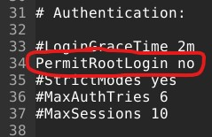

### Sisällysluettelo
- [Aloitustilanne](#Aloitustilanne) 
- [Pilvipalvelu](#pilvipalvelu)
- [Weppipalvelin](#weppipalvelin)
- [Murtautumiset](#Murtautumiset)
- [Tiivistelmä](#Tiivistelmä)
- [Lähteet](#lähteet)


# Aloitustilanne

- Aloitetaan 17:12 8/2/2023

### Virtualisointi
- Virtualisoitu VirtualBox 7.0.4
- Käyttöjärjestelmänä Debian GNU/Linux 11 (bullseye) x86-64 arkkitehtuuri 
- 8GB RAM
- 60GB dynaamista muistia (NVMe SSD)
- 2 Corea Ryzen 5 3600 6-core

### "Host" kone
- Win 10 pro x64
- Ryzen 5 3600 6-core
- RTX 3060
- Ram 16GB
- SSD 1 NVMe (~500GB)
- SSD 2 SATA (~500GB)


# Pilvipalvelu

17:15

Vuokrasin pilveä sivulta https://www.linode.com, kirjauduin sivulle ja etenin kunnes sain vuokrattua "Nanode 1GB" palvelimen. Koko prosessi onnistui ongelmitta.


# Alkutoimet

17:18

Avasin ssh yhteyden kirjauduttuani virtuaalikoneelle komennolla

    ssh root@ip

ensiksi päivitin paketit

    sudo apt-get update
    
    sudo apt-get upgrade
    
sitten asensin ohjelmat ```sudo apt-get install x```komennolla, tässä kohtaa asensin UFW:n, micron sekä apachen valmiiksi.

Ennen palomuurin käynnistystä tehdessäni alkutoimia loin reiän siihen, että pääsen itse kirjautumaan ja valmiiksi että saan apachen näkymään netissä.

    sudo ufw allow 22/TCP
    
    sudo ufw allow 80/tcp 
    
Sitten loin itselleni uuden käyttäjän "romeo", jolle annoin salasanan sekä oikeuksia

    sudo adduser romeo 
    
    sudo adduser romeo sudo
    
    sudo adduser romeo adm
    
Yritin ohjeiden mukaan myös ajaa

    sudo adduser romeo admin
    
Mutta tämä ei onnistunut, sain seuraavan viestin "adduser: The group 'admin' does not exist." selvittelinkin tätä tunnilla, ongelmana on siis se, ettei "admin" ryhmää
ole olemassa. Sama vastaus löytyi myös googlesta, koska sudo-oikeudet oli jo annettu en välittänyt tästä vaan siirryin eteenpäin.


Seuraavaksi lukitsin root-käyttäjän komennolla

    sudo usermod --lock root

Tuo komento lukitsee salasanan niin, ettei salasanalla pääse kirjautumaan, tämän lisäksi editoin konffistiedostoa sijainnissa /etc/ssh/sshd_config niin, ettei 
root loginia sallita.

    sudo export EDITOR=micro
    
    sudoedit /etc/ssh/sshd_config



Muutin kuvassa näkyvän kohdan yes -> no. 
Käynnistin tämän jälkeen ssh palvelun uudelleen

    sudo service ssh restart
    


# Weppipalvelin

17:34

Apache oli jo aikaisemmin asennettuna (ylempänä näkyy kun sen sudo apt-getillä hain) joten jäljellä oli ainoastaan sivun luominen niin, että se a) näkyy ja 
b) ei ole "default page"

Tein tämän muokkaamalla tiedostoa /var/www/html/index.html, lisäsin sinne yksinkertaisesti "Moi!" ja tämän jälkeen starttasin apachen
 
    sudo systemctl start apache2
    
Menin tarkistamaan sivulta "http://143.42.59.187/" näkyykö viesti sielä, ja kyllä näkyi (tein tämän host koneella)


# Murtautumiset

17:44

Menin ohjeiden mukaan katsomaan mitä löydän /var/log/auth.log:ista.

    sudo /var/log/auth.log

Selasin kohtaan jossa kellonajan mukaan (päivämäärä ja kellonaika näkyvät kuvassa vasemmalla ensimmäisinä) tiesin ettei kyseessä voinut olla oma kirjautumiseni.
Seuraavia tapahtumia löysin, otin kuvan muutamasta yrityksestä, mutta niitä löytyi huomattavasti enemmän.


    

# Tiivistelmä

17:50

Tehtävänä oli tiivistää https://terokarvinen.com/2017/first-steps-on-a-new-virtual-private-server-an-example-on-digitalocean/ Tero Karvisen ensimmäiset askeleet uudelle
virtuaaliserverin hostille.

- Käytä aina hyviä salasanoja, "hyvää" ei tässä määritellä, mutta on suositeltavaa että salasana on mahdollisimman pitkä ja siihen sisältyy erikoismerkkejä, numeroita
sekä isoja ja pieniä kirjaimia. Salalauseiden käyttö on myös suositeltavaa.
- Kun serveri on selvillä pääset sinne terminaalista ensimmäistä kertaa komennolla ssh root@ip
- Luo itsellesi reikä palomuuriin sudo ufw allow 22/TCP ja sen jälkeen kytke palomuuri päälle sudo ufw enable
- Luo itsellesi käyttäjä jolle annat sudo-oikeudet, lukitse root kirjautuminen sekä komennolla sudo usermod --lock root, että menemällä /etc/ssh/sshd_config ja 
muuttamalla se kielletyksi sieltä.
- Päivitä paketit ja käytä palvelinta mielesi mukaan!

Valmista 18:04.

# Lähteet
- https://terokarvinen.com/2023/linux-palvelimet-2023-alkukevat/#h5-maailman-suosituin
- https://terokarvinen.com/2017/first-steps-on-a-new-virtual-private-server-an-example-on-digitalocean/
- https://superuser.com/questions/917228/sudo-adduser-username-admin-leads-to-adduser-the-group-admin-does-not-exis
- https://terokarvinen.com/2017/first-steps-on-a-new-virtual-private-server-an-example-on-digitalocean/
