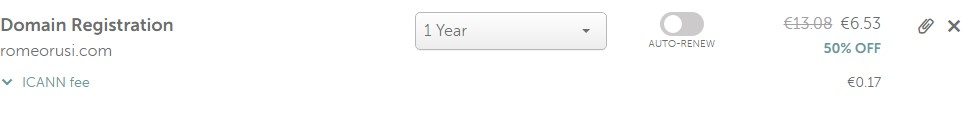
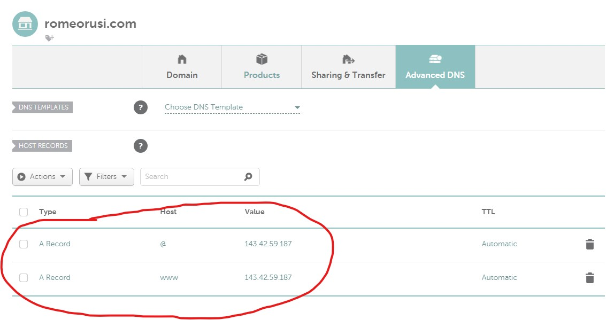
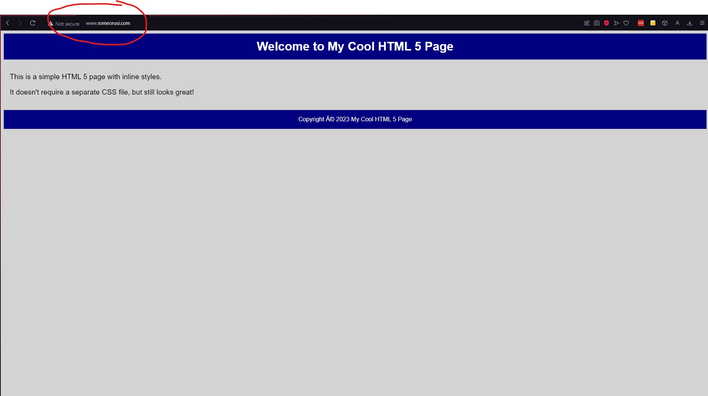
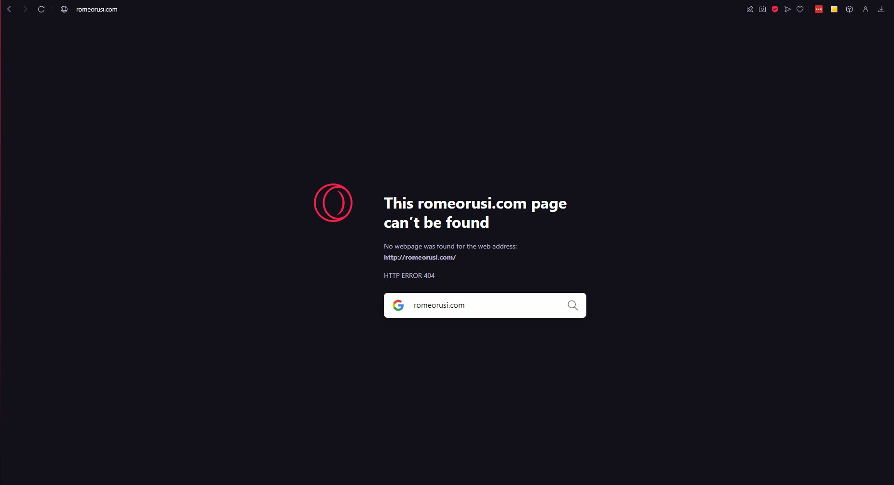
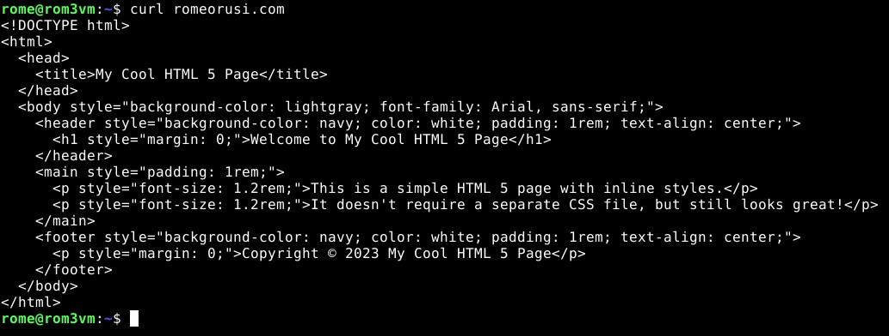
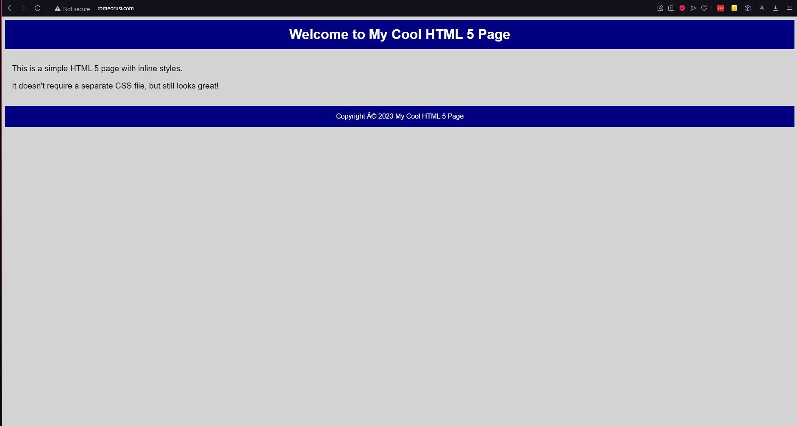
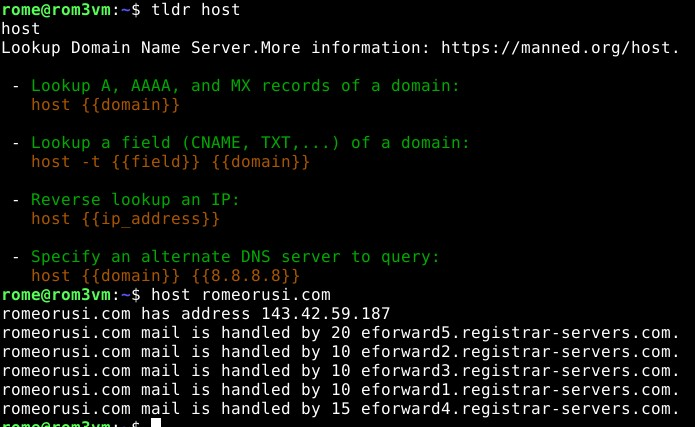
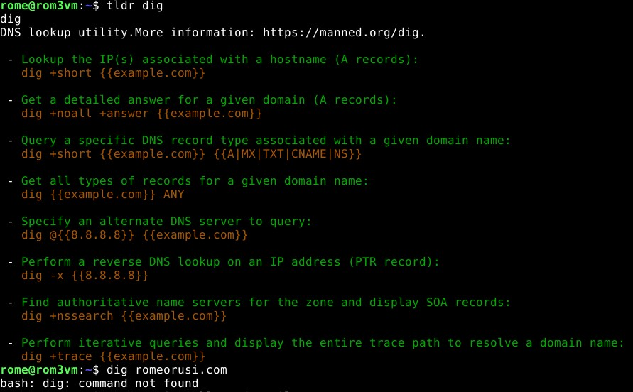
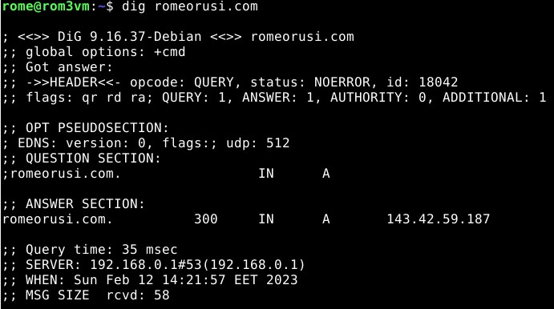

### Sisällysluettelo
- [Aloitustilanne](#Aloitustilanne) 
- [Domainnimi](#Domainnimi)
- [Lähteet](#lähteet)


# Aloitustilanne

- Aloitetaan 13:05 12/2/2023

### Virtualisointi
- Virtualisoitu VirtualBox 7.0.4
- Käyttöjärjestelmänä Debian GNU/Linux 11 (bullseye) x86-64 arkkitehtuuri 
- 8GB RAM
- 60GB dynaamista muistia (NVMe SSD)
- 2 Corea Ryzen 5 3600 6-core

### "Host" kone
- Win 10 pro x64
- Ryzen 5 3600 6-core
- RTX 3060
- Ram 16GB
- SSD 1 NVMe (~500GB)
- SSD 2 SATA (~500GB)


# Domainnimi

Tämän viikon tehtävänä oli vuokrata domainnimi ja asettaa se tietylle sivulle. Aloitin menemällä namecheap.comiin ja luomalla käyttäjän. Käyttäjän luonnin jälkeen kirjoitin 
"domain search" hakukenttään haluamani domainin. Päädyin tunnillakin esitettyyn esimerkkiin "romeorusi.com". Hintaa hankkinnalle ei paljoa tullut, kun miettii että 
kyseessä on tosiaan vuosittainen menoerä.



Mentyäni ostoprosessissa eteenpäin niin, että osto onnistui, navigoin namecheap.comissa käyttäjän dashboardiin ja siellä "advanced dns" sivulle. Sivulla lisäsin kaksi
"A-record" tyyppistä yhteyttä ja ohjasin molemmat oman palvelimen IP-osoitteeseen. Toisen "host" kohtaan kirjoitin @, ja toiseen www. Tämä tarkoittaa, että romeorusi.com
sekä www.romeorusi.com vievät molemmat sivulle tuolla IP-osoitteella




Äsken kuvaillun osan jälkeen tarkistin välittömästi romeorusi.com sivua, joka ei vielä toiminut. Otin lasin vettä ja sen jälkeen sivu toimi suoraan. Kaikki ei kuitenkaan
ollut vielä valmista. Huomasin, että vain www.romeorusi.com toimii, romeorusi.com ei palauttanut mitään.

www.romeorusi.com



romeorusi.com 



Kokeilin myös chromella, mutta valitettavasti tulos on sama. Curlasin sivun linuxilla ja sain palautteeksi (ilman www prefixia) sivun oikean koodin. Sivu ei kuitenkaan
toiminut millään selaimella. Googlasin mistä asia voisi riippua ja sain vastaukseksi, että muutokset voivat viedä hetken aikaa.



Pidin noin ~10 minuutin tauon enkä tehnyt kirjaimellisesti mitään tuohon aikaan, ja sivu alkoi itsestään toimimaan. 



Oletettavaa siis on, että jokin osa prosessista saattaa kestää pidempää. Lopputulos on kuitenkin se, että www.romeorusi.com sekä romeorusi.com toimivat. Kaikki viimein
ok.


Seuraavaksi tutkin host ja dig komentoja. En ollut varma mitä host tekee, joten aloitin kirjoittamalla ```tldr host``` tämä hyödyntää asentamaani ohjelmaa "tldr" joka
käytännössä tekee saman kuin man, mutta selkemmässä formaatissa. Tällä sain tietää että host kertoo DNS:stä tietoja. Seuraavaksi kirjoitin komennon ```host romeorusi.com```

Seuraavan promptin sain tulosteeksi: 



"romeorusi.com has address 143.42.59 187" on oletettava tuloste, joka yksinkertaisuudessaan listaa IP-osoitteen johon nimellä yhdistettään. Seuraavat rivit ovat kryptisempiä. "romeorusi.com mail is handled by 20 eforward5.registrar-servers.com." En löytänyt millään fiksulla hakusanalla mitään mikä selittäisi tuota tulostetta. Oletettavaa tekstin perusteella on vain, että tieto kulkee jossain määrin jollain tavalla sivulta romeorusi.com sivun eforward5.registrar-servers.com sivun kautta.

Seuraavaksi dig. Jälleen, ajoin ```tldr dig``` jolla sain vähän tietoa siitä mitä komento tekee ja millaisessa formaatissa sitä voi käyttää, sitten koitin ajaa komennon ```dig romeorusi.com``` tämä ei kuitenkaan onnnistunut, sillä komentoa ei löytynyt. 



Muistan vastaavan ongelman muiden ohjelmien kanssa ja tiedän sen tarkoittavan ettei komentoa/sovellusta ole vielä asennettu. Googlasin suoraan "linux debian 11 how to install dig" ja sain kätevästi vastaukseksi ```apt-get install -y dnsutils``` ajoin sen suoraan. Tällä kertaa onnistui ja sain seuraavan näkymän palautteeksi:



Löysin kattavan selityksen googlesta tulosteen analysoimiseksi etsimällä "linux dig prompt explained". Vastaus oli seuraavanlainen: Answer kohta on merkityksellisin ja sieltä löytyy ```romeorusi.com.		300	IN	A	143.42.59.187``` seuraavanlainen kohta. Vasemmalta oikealle mentäessä: romeorusi.com on palvelimen nimi jolle pyyntö tehtiin, 300 on "time to live" numero joka kertoo millisekunteina kuinka kauan pyyntö on validi löysin tästä lisää tietoa cloudflaren sivuilta. IN on pyynnön "luokka" ja A on pyynnön tyyppi. IN tarkoittaa internetiä ja A Addressia, viimeisen IP:n tunnistankin, se on IP jonka namecheapissa sijoitin A recordiin, eli oman palvelimeni ip-osoite.

Valmis 14:29

# Lähteet
- https://terokarvinen.com/2023/linux-palvelimet-2023-alkukevat/#h8-say-my-name
- https://linuxhint.com/install-dig-debian-11/
- https://phoenixnap.com/kb/linux-dig-command-examples
- https://developers.cloudflare.com/dns/manage-dns-records/reference/ttl/#:~:text=Time%20to%20Live%20(TTL)%20is,to%20reach%20your%20end%20users.
