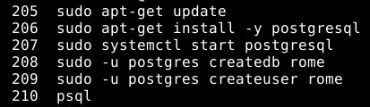
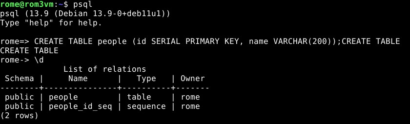
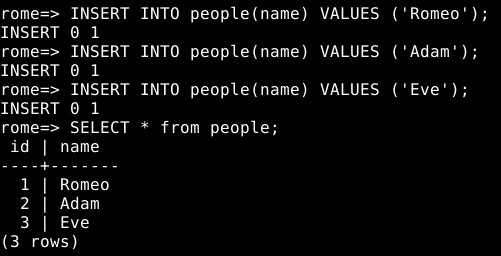
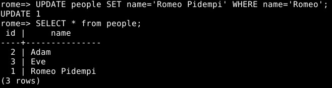
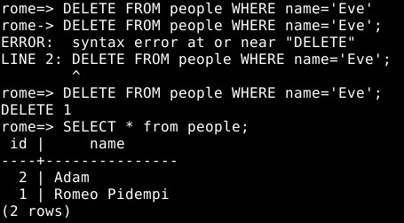

# h9

### Sisällysluettelo
- [Aloitustilanne](#Aloitustilanne) 
- [Yrityssoftaa](#Yrityssoftaa)
- [Postgre](#Postgre)
- [CRUD](#CRUD)
- [Lähteet](#lähteet)

# Aloitustilanne

- Aloitetaan 14:53 15/2/2023

### Virtualisointi
- Virtualisoitu VirtualBox 7.0.4
- Käyttöjärjestelmänä Debian GNU/Linux 11 (bullseye) x86-64 arkkitehtuuri 
- 8GB RAM
- 60GB dynaamista muistia (NVMe SSD)
- 2 Corea Ryzen 5 3600 6-core

### "Host" kone
- Win 10 pro x64
- Ryzen 5 3600 6-core
- RTX 3060
- Ram 16GB
- SSD 1 NVMe (~500GB)
- SSD 2 SATA (~500GB)

# Yrityssoftaa
Aloitetaan 15:00
Esimerkki palvelusta, jossa tietokantoja voidaan hyvin hyödyntää on esimerkiksi verkkokaupat. Toisella kurssilla suunnittelimme tietokantarakeenteen kuvitteelliselle verkkokaupalle jossa myytiin pelejä, konsoleita ja oheistuotteita. Tietokannan käyttö auttaa skaalautuvuudessa huomattavasti ja saattaa tarjota käyttäjälle nopeamman kokemuksen mikäli koodi ajetaan palvelimella eikä käyttäjän selaimessa.

# Postgre
Aloitetaan 15:07

Ajoin ohjeista löytyvät komennot annetussa järjestyksessä, mikään komento ei tuottanut ongelmia, mutta tekstiä tuli sen verran että kuvan päätin hakea historystä.

# CRUD
Aloitetaan 15:11

Vaikka linkki löytyykin lähteistä tähän kohtaan oli todella hyvät ja kattavat ohjeet linkissä https://terokarvinen.com/2016/03/05/postgresql-install-and-one-table-database-sql-crud-tutorial-for-ubuntu/ En ole henkilökohtaisesti kirjoittanut SQL:ää yli vuoteen joten nämä tulivat tarpeeseen.

Ensin luotiin taulu, jotta voimme laittaa sinne tietoa, muokata sitä sekä lopuksi poistaa sen. Ajoin \d jotta pääsin tarkastelemaan onnistuiko taulun luonti.

Laitoin tietokantaan 3 nimeä ja tarkistin että ne näkyvät taulussa.

Muokkasin omaa nimeäni.

Lopuksi poistin taulusta ne, joiden "nimi" kohdassa luki 'Eve'. Onnistuin säätämään tuossa hetken jotain, en laittanut aluksi ; komennon perään ja kuten kuvasta huomaa käyttäjän nimi muuttui hieman (rome=> muuttui rome->) en tiedä mitä tuo käytännössä tarkoittaa, mutta kun ajoin komennon tuolloin uudelleen korjattuna herjasi liittymä virhettä. Ongelma kuitenkin ratkesi itsestään ja lopuksi näemme että tietokannasta on poistunut juuri haluamamme tieto.

Loppu 15:21

Kaikki luettu 15/2/2023
# Lähteet 
- https://terokarvinen.com/2023/linux-palvelimet-2023-alkukevat/#h9-sequel
- https://www.nibusinessinfo.co.uk/content/benefits-database-development
- https://terokarvinen.com/2016/03/03/install-postgresql-on-ubuntu-new-user-and-database-in-3-commands/
- https://terokarvinen.com/2016/03/05/postgresql-install-and-one-table-database-sql-crud-tutorial-for-ubuntu/
