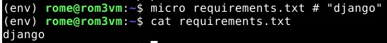

# H10

### Sisällysluettelo
- [Aloitustilanne](#Aloitustilanne) 
- [Kannattavaa](#Kannattavaa)
- [Lähteet](#lähteet)


# Aloitustilanne

- Aloitetaan 18:03 26/2/2023

### Virtualisointi
- Virtualisoitu VirtualBox 7.0.4
- Käyttöjärjestelmänä Debian GNU/Linux 11 (bullseye) x86-64 arkkitehtuuri 
- 8GB RAM
- 60GB dynaamista muistia (NVMe SSD)
- 2 Corea Ryzen 5 3600 6-core

### "Host" kone
- Win 10 pro x64
- Ryzen 5 3600 6-core
- RTX 3060
- Ram 16GB
- SSD 1 NVMe (~500GB)
- SSD 2 SATA (~500GB)


# Kannattavaa
Aloitin ajamalla 

    sudo apt-get update
    
    sudo apt-get install -y virtualenv
    
En kohdannut ongelmia asennuksessa joten siiryin ohjeiden mukaisesti luomaan virtuaaliympäristön
    
    virtualenv --system-site-packages -p python3 env/
    
Avataan ympäristö

    source env/bin/activate
    
Komento onnistui ja kuten kuvasta huomataan promptissa lukee (env), kuten ohjeissakin oli mainittu.


Ennen seuraavaa komentoa ohjeissa muistutetaan olemaan ajamatta pip:piä sudona tai ilman virtualenviä.

    which pip
    


Ajoin komennon ```micro requirements.txt # "django"``` ja kirjoitin tiedostoon "django". Tarkistin komennolla ```cat requirements.txt``` että tiedostosta löytyi sana.



Kaikki onnistui joten asensin djangon

    pip install -r requirements.txt
    


En huomannut ongelmia, varmistin vielä komennolla ```django-admin --version``` että kaikki onnistui. Kyllä.


    
Ajoin komennot 

    django-admin startproject testi
    
    cd testi
    
ja

    ./manage.py runserver
    


Kaikki toimii oletetusti ja sivu näkyy selaimessa.


Ajoin komennot ```./manage.py makemigrations``` ja ```./manage.py migrate``` jotta sain päivitettyä tietokonnat. Kaikki onnistui


Tämän jälkeen tehtävänä oli lisätä käyttäjä ja luoda sille luotettava salasana, tähän käytettiin apuna salasanageneraattoria joten asensin sen ensin.

    sudo apt-get install pwgen
    
    pwgen -s 20 1

    ./manage.py createsuperuser

Testatakseni käyttäjää käynnistin serverin uudelleen samalla komennolla kuink aikaisemmin. Muutin URLia lisäämällä sen perään /admin jotta pääsin kirjautumaan. 
Kirjautuminen juuri luomillani tunnuksilla onnistui ongelmitta. 


Loin toisen käyttäjän nimellä "toinenid", generoin sille vahvan salasanan ja onnistuin kirjautumaan sillä samaa reittiä /admin polun kautta.


### Aloin luomaan tietokantaa.

    ./manage.py startapp crm
    
Tämän jälkeen avasin tiedoston settings.py ja lisäsin "installed apps" kohtaan 'crm'


Tämän tehtyäni siirryin eteenpäin tiedostoon models.py lisäämään ohjeistuksessa annettua koodia, jotta tietokanta saadaan valmiiksi. Muokkasin models.py tiedostoa niin,
että sen sisältö vastasi tätä:

    from django.db import models

    # Create your models here.
    class Customer(models.Model):
       name = models.CharField(max_length=300)

Ajoin seuraavat komennot jotta tieto saatiin tallennettua.


Sen tehtyäni siirryin admin.py tiedostoon ja muokkasin sen sisällön seuraaavanlaiseksi, jälleen tarkalleen ohjeiden mukaan.

    from django.contrib import admin
    from . import models
    # Register your models here.
    admin.site.register(models.Customer)

Käynnistin serverin uudelleen samalla komennolla kuin viimeksi ```./manage.py runserver``` ja tarkistin, että onnistuin lisäämään sekä poistamaan asiakkaan. 

Viimeiseksi tehtävä oli enää listata asiakkaiden nimet fiksummin. Lisäsin tiedostooon models.py sisältöä ohjeiden mukaan niin, että lopputulos oli seuraavanlainen:

    from django.db import models

    class Customer(models.Model):
        name = models.CharField(max_length=160)

        def __str__(self):		# new
            return self.name	# new

Tämän jälkeen tehtävä oli valmis, lopetin 18:55.


# Lähteet 
Kaikki luettu 26/2/2023
- https://terokarvinen.com/2023/linux-palvelimet-2023-alkukevat/#h10-dj-ango
- https://terokarvinen.com/2022/django-instant-crm-tutorial/
