# H11

### Sisällysluettelo
- [Aloitustilanne](#Aloitustilanne) 
- [Tuotantoasennus](#Tuotantoasennus)
- [Lähteet](#lähteet)


# Aloitustilanne

- Aloitetaan 12:55 1/3/2023

### Virtualisointi
- Virtualisoitu VirtualBox 7.0.4
- Käyttöjärjestelmänä Debian GNU/Linux 11 (bullseye) x86-64 arkkitehtuuri 
- 8GB RAM
- 60GB dynaamista muistia (NVMe SSD)
- 2 Corea Ryzen 5 3600 6-core

### "Host" kone
- Win 10 pro x64
- Ryzen 5 3600 6-core
- RTX 3060
- Ram 16GB
- SSD 1 NVMe (~500GB)
- SSD 2 SATA (~500GB)


# Tuotantoasennus

Tehtävän tarkoituksena on tehdä Djangoon tuotantoasennus. Poistin aikasemmin tekemäni testi-directoryn jotta pystyin ohjeiden mukaan tekemään kaiken oikein alusta loppuun. Ensimmäisenä päivitin kaikki paketit ```sudo apt-get update``` ja asensin microon bashin ```sudo apt-get -y install micro bash-completion``` ja laitoin micron pääasialliseksi tekstieditoriksi komennolla ```export EDITOR=micro```. Apache oli valmiina asennettuna, joten sen asennusta en tässä raportissa käy läpi. Tiedettäköön siitä kuitenkin sen verran, että olen aikaisemmin muokannut ```var/www/html/index.html``` kohtaan itselleni sivun, joten tarvittaessa tunnistan onnistuuko vai ei.

Komennolla ```echo "Jotain asiaa"|tee publicwsgi/rtesti/static/index.html``` loin yksinkertaista sisältöä juuri luotuun index.html tiedostoon. Tarkistin onnistuiko komento kirjoittamalla "cat alt + ." joka kopioi aikaisemman tiedostokohteen suoraan komentoriville. Kuten kuvasta huomaa tieto on tallentunut.

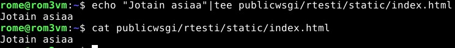


Komennolla ```sudoedit /etc/apache2/sites-available/rtesti.conf``` loin ja pääsin muokkaamaan tiedostoa. Muokkasin tiedosta niin, että sen sisältö vastasi seuraavaa:

    <VirtualHost *:80>
      Alias /static/ /home/rome/publicwsgi/rtesti/static/
      <Directory /home/rome/publicwsgi/rtesti/static/>
        Require all granted
      </Directory>
    </VirtualHost>

Editoidessa tiedostoa huomasin alareunassa seuraavanlaisen polun, joka johtaa temp-tiedostoon. En ole varma koituuko tästä myöhemmin ongelmia, mutta en muista aikaisemmin nähneeni vastaavaa. En myöskään ole täysin varma mitä microon lisätty bash tekee, joten en lähtenyt suoraan selvittämään tätä.

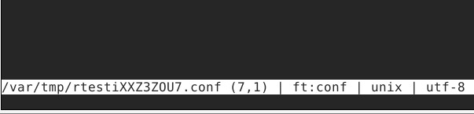


Seuraavaksi komennoilla

    sudo a2ensite rtesti.conf
    sudo a2dissite frontpage.conf
    sudo systemctl restart apache2

Laitoin oikean sivun päälle ja uudelleenkäynnistin apachen jotta sain asiat päivitettyä.

Seuraavaksi tarkistin toimiiko kaikki tähän asti, komennolla ```/sbin/apache2ctl configtest``` kuten ohjeissakin oli mainittu, mikäli palaute oli pelkästään ongelma AH00558:n kanssa hommat ovat tähän asti oikein. Sain pelkästään tuon "virheilmoituksen" joten kaikki oli ok.

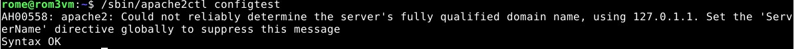


Tarkistin ```curl http://localhost/static/``` onko kaikki ok tähän asti ja sain palautteeksi aikaisemmin index.html tiedostoon tallentamani "Jotain asiaa". Kaikki siis tässäkin tähän asti ok.

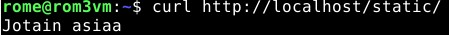


### Virtualenv

Nyt asentamaan virtualenv. Ajoin kuvassa näkyvät komennot ja ohjeistuksen perusteella tämä luo directoryn kohtaan /home/rome/publicwsgi/env/ promptistakin näkee tuon tiedostosijainnin mainittaneen.

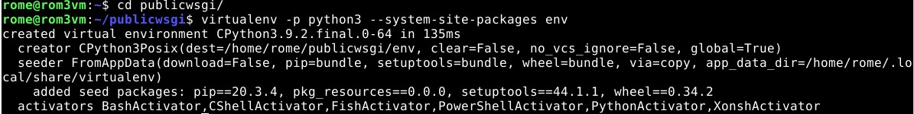

Tämän jälkeen ajoin komennon ```source env/bin/activate``` joka aktivoi virtualenvin ja muuttaa promptiin jälleen (env) "prefixin". Tarkistin vielä missä olen komennolla ```which pip``` ja sain halutun tulosteen: ```/home/rome/publicwsgi/env/bin/pip```. Loin microlla tiedoston requirements.txt kuten aikaseimmin ja pääsin jälleen ajamaan komennon jota **EI** saa ajaa sudona tai virtualenvin ulkopuolella turvallisuusuhkien vuoksi. Lopuksi tarkistin kuvastakin löytyvällä komennolla ```django-admin --version``` onnistumiseni, jälleen, kaikki etenee halutusti ja ohjeiden mukaan.

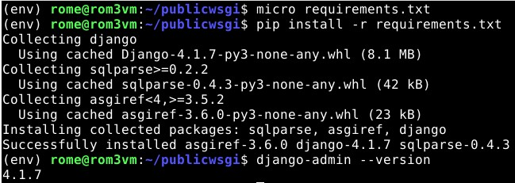

Olin tehtävän alussa poistanut aiemman projektin ja koittaessa luoda uuta sain ilmoituksen että sellainen on jo, joten päätin edetä. Aloitin menemällä komennolla ```sudoedit /etc/apache2/sites-available/rtesti.conf``` oikeaan paikkaan ja kopioimalla ohjeistuksen mukaan sisällön tiedostolle. Muutin kopioituun sisältöön oikeat muuttujat ja sijainnit vastaamaan omaa projektiani ja asettamiani nimiä. 

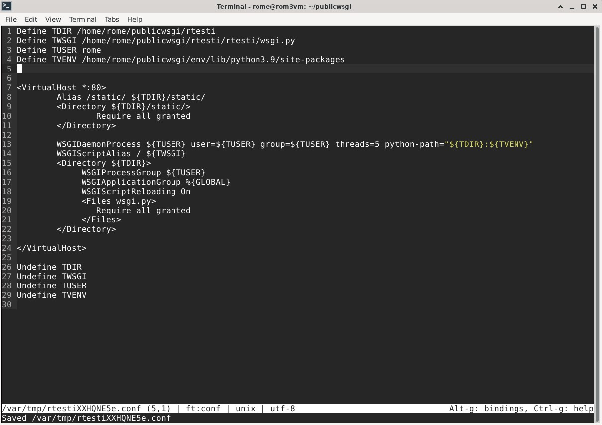

Seuraavaksi asensin apacheen WSGI moduulin komennolla ```sudo apt-get -y install libapache2-mod-wsgi-py3``` ja tarkistin syntaxin uudelleen komennolla. Sain jälleen vain "AH00558"-virheilmoituksen joten kaikki on oletettavasti hyvin. Käynnistin apachen uudelleen komennolla ```sudo systemctl restart apache2``` ja tarkistin toimiiko kaikki komennolla ```curl -s localhost|grep title``` sain vastaukseksi ```<title>403 Forbidden</title>``` joten jokin ei toimi, aloin tarkistelemaan missä vika voisi olla ja aloin epäilemään ettei wsgi.py tiedostoa olisi. Kävin tarkistamassa apachen error logit varmuudeksi, ja sieltä löytyvä tieto lisäsi epäilystäni wsgi.py tiedoston puutteesta, löysin sieltä seuraavanlaisen promptin: ```[Wed Mar 01 13:48:43.141917 2023] [authz_core:error] [pid 4604:tid 140004804884224] [client ::1:54552] AH01630: client denied by server configuration: /home/rome/publicwsgi/rtesti/rtesti```. 

Koitin tunnilla annetun ohjeen mukaan etsiä tiedoston sijaintia komennolla find | grep mutta en valitettavasti täältäkään sitä löytänyt. Googlailin miten ongelman saisi selvitettyä mutta en valitettavasti löytänyt mistä se voisi johtua. Edellisellä tunnilla olin luonut projektin nimeltä "testi" jonka poistin, en osaa sanoa liittyykö tämä siihe, ymmärtääkseni wsgi.py tiedoston tulisi generoitua itsestään. 

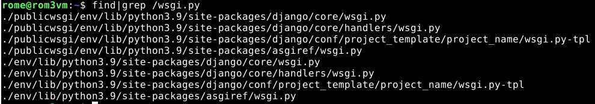

Mietiskelin asiaa noin tunnin verran googlaillen kunnes tajusin, että jostain syystä koska projektin luonti ei onnistunut ei myöskään wsgi.py tiedostoa oltu koskaan luotu. Se, miksi projektin luominen ei onnistunut on minulle kuitenkin puhdas mysteeri, mitään vastaavan nimistä ei tietokoneella ole. Tein seuraavat asiat ja koitin saada asian ratkaistua niillä:

1. ```django-admin startproject testi2```
2. ```export EDITOR=micro```
3. ```sudoedit /etc/apache2/sites-available/testi2.conf```
4. ```sudo rm -r testi2``` (tämä oli se directory jolla koitin tehtävää aluksi tehdä, olin kuitenkin jo aikaisemmin poistanut sen.
5. ```cd publicwsgi/```
6. ```sudo apt-get -y install libapache2-mod-wsgi-py3``` (varmuudeksi, tämä kuitenkin oli jo asennettu.)
7. ```/sbin/apache2ctl configtest``` Jälleen sama lopputulos, AH00558
8. ```curl -s localhost|grep title``` palautuksena <title>403 Forbidden</title>
9. ```django-admin startproject toivo```
10. ```cd toivo```
11. ```./manage.py runserver``` palautuksena: 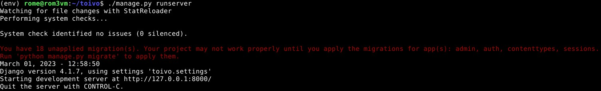 (sammutin kuitenkin heti ctrl+c, tarkistin vaan mitä tapahtuu)
12. ```sudoedit /etc/apache2/sites-available/toivo.conf``` : 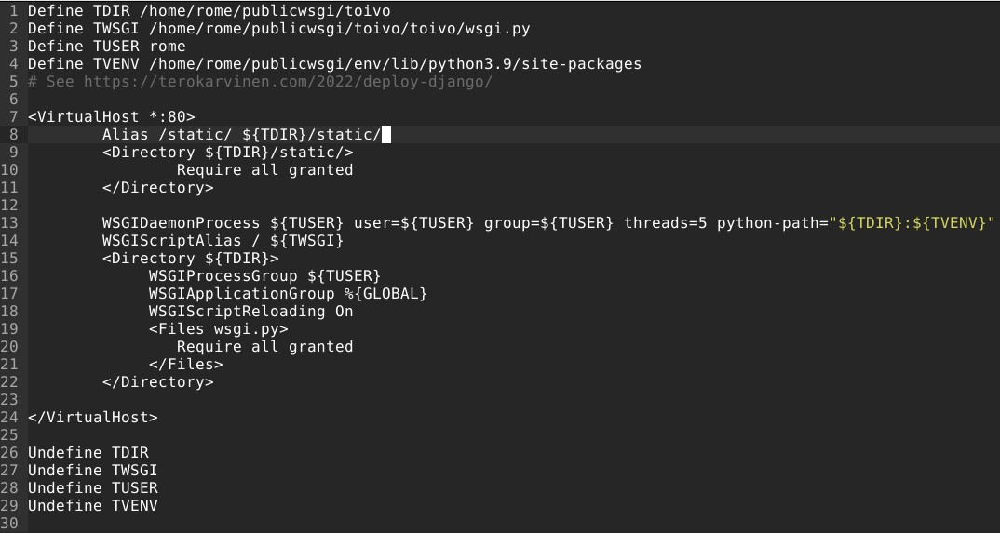 
13. ```cd toivo```
14. ```sudo apt-get -y install libapache2-mod-wsgi-py3``` (jälleen varmuudeksi, jälleen kaikki jo asennettuna. Halusin vain varmistua ettei asennus ole jostain syystä mennyt pieleen/väärän paikkaan)
15. ```/sbin/apache2ctl configtest``` (sama lopputulos, AH00558)
16. ```sudo systemctl restart apache2```
17. ```curl -s localhost|grep title``` (palautuksena <title>403 Forbidden</title>)
18. ```sudoedit /etc/apache2/sites-available/teroco.conf``` (tässä kohtaa ilmiselvä virhe joka vei hiukan aikaa ja itseasiassa rikkoi apachen hetkeksi, kopioin siis komennon ohjeista enkä tajunnut muuttaa tuota teroco:a toivo:ksi, laitoin siällön ohjeiden mukaan mutta toivo.conf oli edelleen tyhjä eikä apache toiminut, korjasin tämän kuitenkin myöhemmin ja editoin oikeaa kohtaa ```sudoedit /etc/apache2/sites-available/toivo.conf ``` virhe jonka sain: 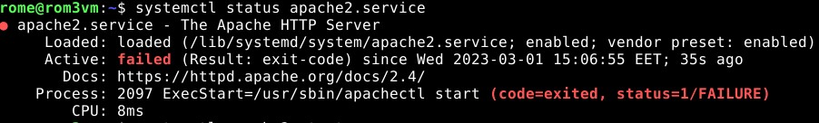  )
19. ```mkdir -p publicwsgi/toivo/static```
20. ```echo "jotain"|tee publicwsgi/toivo/static/index.html```
21. ```sudo a2ensite toivo.conf```
22. ```sudo a2dissite testi2.conf```
23. ```sudo a2dissite rtesti.conf```
24. ```sudo systemctl restart apache2``` (tässä kohtaa apache ei suostunut enää toimimaan, kuitenkin hetken mietittyäni ymmärsin kirjoitusvirheen jonka tein aikaisemmin ja sain asian nopeasti korjattua)
25. ```echo "Apachen perus sivu"|sudo tee /var/www/html/index.html```

Lopuksi sain 403 error-viestin, kun kävin katsomassa error logeista seuraava rivi oli kertomassa virheestä
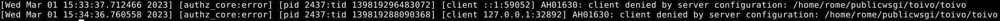 

Kävin katsomassa kaikki .py tiedostot läpi /home/rome/toivo/toivo/wsgi.py directoryssä mutta mistään en löytänyt keinoa säätää oikeuksia. Tajusin, että olin luonut projektin oletettavasti väärän paikkaan joten wsgi.py ei löytynyt ohjeissa kerrotusta paikasta, tiesin kuitenkin mistä se löytyi ja muutin oikean sijainnin TWSGI variableen 
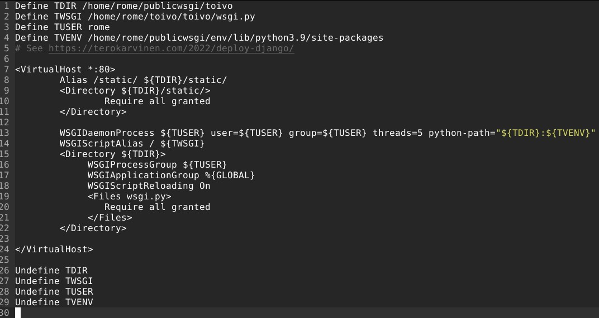 

Tämäkään ei ratkaissut asiaa. Jouduin valitettavasti myöntämään tappion tässä kohtaa ja siirtymään muihin asioihin. Viimeinen virhekoodi jonka saan on "AH01630: client denied by server configuration: /home/rome/toivo/toivo/wsgi.py" mutta wsgi.py tiedostossa ei ole mitään minkä ymmärtäisin ongelmaan vaikuttavan ja TWSGI on määritetty ymmärtääkseni oikein. Googlaamalla en löytänyt ongelmaani.

Lopetus 16:05 

To 2/3/2023 palasin vielä tarkistamaan asiaa, jos menen ```cd toivo``` ```./manage.py runserver``` saan sivun näkymään komennolla ```curl http://127.0.0.1:8000/``` (ja tietysti myös menemällä selaimessa samaan osoitteseen. 

Muutin vielä debugin falseksi ja kirjoitin allowed hosts kohtaan "localhost", tämä ei muuttanut mitään vaan sivu palauttaa edelleen 403. 

Ennen tunnin alkua katselin ongelmaa jälleen ja tajusin että toivo.conf sisälsi väärän tiedostosijainnin TDIR kohdassa. Otin sijainnnista publicwsgi:n pois ja näin sain "404 not found" virheilmoituksen näkymään.

Menin lisäämään 

        import os
        STATIC_ROOT = os.path.join(BASE_DIR, 'static/')

rivit settings.py tiedostoon ja tämän jälkeen ajoin ```./manage.py collectstatic``` komennon joka näytti siltä että jotain tapahtuu, mutta palautti syntax errorin "invalid syntax". 

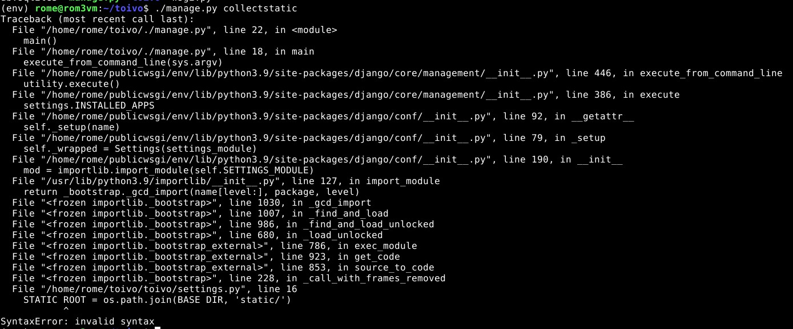 

Ajoin ```sudo systemctl restart apache2``` ja sain seuraavan palautteen komennolla ```curl localhost``` ja sain palautteeksi:

        <title>500 Internal Server Error</title>
     
Tuon tekemisen jälkeen jos ajan

        cd
        cd toivo
        ./manage.py runserver
        
saan seuraavanlaisen ongelman aikaiseksi:

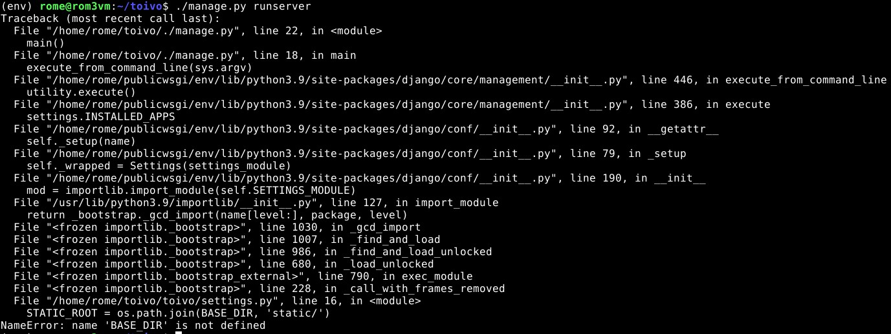 

# Lähteet
- https://terokarvinen.com/2022/deploy-django/
