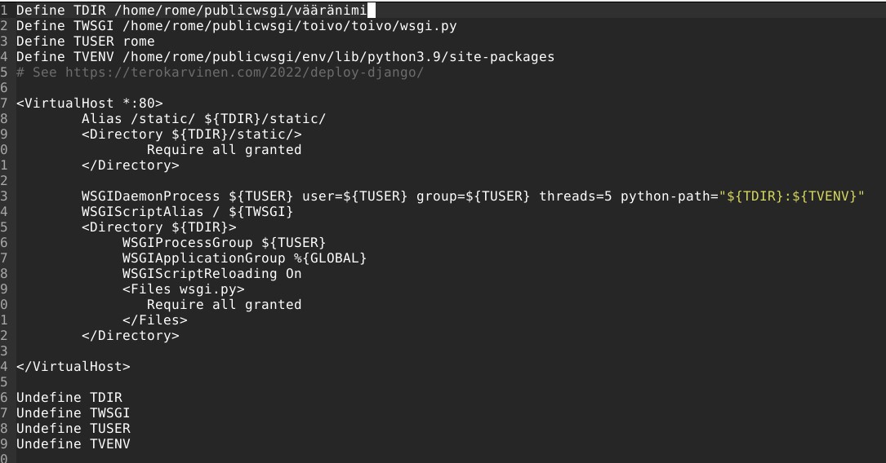

# H12

### Sisällysluettelo
- [Aloitustilanne](#Aloitustilanne) 
- [Python kirjoitusvirhe](#Python-kirjoitusvirhe)
- [Django väärässä paikassa](#Django-väärässä-paikassa)
- [Väärät oikeudet](#Väärät-oikeudet)
- [Apache kirjoitusvirhe](#Apache-kirjoitusvirhe)
- [WSGI puuttuu](#WSGI-puuttuu)
- [Väärä allowed hosts](#Väärä-allowed-hosts)
- [Lähteet](#lähteet)

WSGI puuttuu

# Aloitustilanne

- Aloitetaan 16:20 5/3/2023

### Virtualisointi
- Virtualisoitu VirtualBox 7.0.4
- Käyttöjärjestelmänä Debian GNU/Linux 11 (bullseye) x86-64 arkkitehtuuri 
- 8GB RAM
- 60GB dynaamista muistia (NVMe SSD)
- 2 Corea Ryzen 5 3600 6-core

### "Host" kone
- Win 10 pro x64
- Ryzen 5 3600 6-core
- RTX 3060
- Ram 16GB
- SSD 1 NVMe (~500GB)
- SSD 2 SATA (~500GB)
- 


# Python kirjoitusvirhe

Aloitin käynnistämällä virtualenvin ```source env/bin/activate``` ja tarkistamalla toimiiko django. Django ei aluksi toiminut, koska tunnilla olimme säätäneet sen rikkinäiseksi tahallaan. 

 

 

Ongelmana oli siis se, että settings.py tiedostossa "Allowed hosts" kohdassa oli "localhost", kun muutin sen tyhjäksi sivu alkoi toimimaan normaalisti. En etsinyt tästä lokinmerkintää, sillä sain tässä ongelmassa poikkeuksellisesti riittävän tiedon selaimesta, lokimerkintä näkyy myös suoraan terminaalissa.


# Django väärässä paikassa

Siirsin "toivo" projektin käyttäjän rome alle (kuten se oli ollutkin aikaisemmin ja johtanut ongelmiin 

    sudo mv toivo/ /rome 
    
Yrittäessä ajaa ./manage.py runserver kansiossa jossa .manage.py oli aikaisemmin ollut sain seuraavan ongelman ```bash: ./manage.py: No such file or directory``` tämä oli loogista, sillä tiedostoa ei enää ollut. Siirsin tiedoston takaisin (olin vahingossa nimennyt sen uudestaan /rome/ksi) komennolla ```sudo mv /rome/ /home/rome/publicwsgi/toivo``` tarkistin lopuksi selaimessa toimiiko django ja pääsin haluttuun näkymään. 


# Väärät oikeudet

Tässä kohtaa seurasin ohjeita tismalleen sillä en ymmärtänyt komentoja ollenkaan, navigoin projektikansioon joka sijaitsi publicwsgi/toivo ja ajoin ohjeissa näkyvän komennon ```'chmod ugo-rwx toivo/'``` koitin heti tämän jälkeen ilman minkään uudelleenkäynnistystä käynnistää djangon ```./manage.py runserver``` ja sain suuren määrän virheitä


Virheilmoituksesta sain sen verran selvää, ettei toivo.settings tiedostoa näkynyt, tiesin että se kuitenkin oli olemassa vielä samassa paikassa, joten tästä pystyi helposti päättelemään oikeuksien muuttuneen ja sen vaikuttavan tiedoston löytymiseen. Ajoin komennon ```curl localhost``` ja menin tarkistamaan ohjeissakin mainitut apachen error.logit ```sudo cat /var/log/apache2/error.log``` löysin sieltä seuraavan lokimerkinnän: ```[Sun Mar 05 17:13:39.471939 2023] [core:error] [pid 2949:tid 140718716491520] (13)Permission denied: [client ::1:56130] AH00035: access to / denied (filesystem path '/home/rome/publicwsgi/toivo/toivo/wsgi.py') because search permissions are missing on a component of the path``` tämä varmisti aikaisemman päättelyni ja näytti ettei ohjelmalla ollut oikeuksia lukea vaadittuja tiedostoja.

Lähdin korjaamaan tilannetta ja menin projektikansioon ajamaan ohjeiden toisen komennon ```chmod u+rx toivo/```, tämä ei kuitenkaan korjannut tilannetta vaan sain edelleen saman palautteen curlatessa localhostin. Lopulta sain ongelman korjattua ajamalla ```chmod ugo+rwx toivo/``` uudelleen sekä publicwsgi:n alla olevalle toivo:lle, että toivo:n alla olevalle toivo:lle.


# Apache kirjoitusvirhe

Navigoin suoraan edellisistä tehtävistä ja tunneista tuttuun sites-available konffikseen muuttamaan tekstiä vääräksi. 



Muutin TDIR:ää niin ettei viimeisin sana ollut oikea "toivo" vaan "vääränimi" ja tallensin tiedoston, käynnistin tietysti apachen uudelleen tutulla ```sudo systemctl restart apache2``` komennolla ja ajoin ```curl localhost```

Sain seuraavanlaiset ongelman aikaiseksi: 


ja lokeissa: ```[Sun Mar 05 18:02:51.132074 2023] [authz_core:error] [pid 5137:tid 140473811019520] [client ::1:39718] AH01630: client denied by server configuration: /home/rome/publicwsgi/toivo/toivo/wsgi.py``` ongelma ratkesi muuttamalla nimi takaisin oikeaksi ja käynnistämällä apache uudelleen

# WSGI puuttuu

Navigoin projektikansioon ja ajoin ohjeissa annetun komennon "sudo apt-get purge libapache2-mod-wsgi-py3", koitin käynnistää apachen uudelleen mutta sain seuraavanlaisen virheen:


lokeista löyty yksi rivi: ```[Sun Mar 05 18:06:26.363284 2023] [mpm_event:notice] [pid 5232:tid 140057692392768] AH00491: caught SIGTERM, shutting down```

Koitin huvikseni curl localhostia ja sain seuraavan palautteen: ```curl: (7) Failed to connect to localhost port 80: Connection refused```

Lopuksi asensin moduulin vain takaisin komennolla ```sudo apt-get install libapache2-mod-wsgi-py3``` ja curlasin uudelleen localhostin, joka palautti oikean sivun. 


# Väärä allowed hosts

Menin settings.py tiedostoon ja muutin sisältöä niin, että se näytti seuraavalta: ```ALLOWED_HOSTS = ["asdsadasd"]```
ajoin ```./manage.py runserver``` ja sain seuraavan palautteen:


Korjasin asian ja tarkistin että kaikki toimi odotetusti, kyllä vain!

Lopetus 18:15

# Lähteet
- https://terokarvinen.com/2023/linux-palvelimet-2023-alkukevat/
