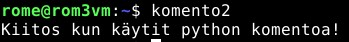
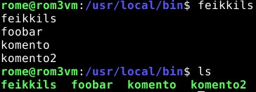

# H14

### Sisällysluettelo
- [Aloitustilanne](#Aloitustilanne) 
- [Komento1](#Komento1)
- [Komento2](#Komento2)
- [Komento3](#Komento3)
- [Lähteet](#lähteet)

WSGI puuttuu

# Aloitustilanne

- Aloitetaan 16:20 8/3/2023

### Virtualisointi
- Virtualisoitu VirtualBox 7.0.4
- Käyttöjärjestelmänä Debian GNU/Linux 11 (bullseye) x86-64 arkkitehtuuri 
- 8GB RAM
- 60GB dynaamista muistia (NVMe SSD)
- 2 Corea Ryzen 5 3600 6-core

### "Host" kone
- Win 10 pro x64
- Ryzen 5 3600 6-core
- RTX 3060
- Ram 16GB
- SSD 1 NVMe (~500GB)
- SSD 2 SATA (~500GB)


Aloitetaan 20:04 12/3/2023


# Komento1

Tehtävänä oli ensin luoda bash komento: 

    cd /usr/local/bin/

    micro komento

kirjoitin tiedoston sisään 

    !/usr/bin/bash

    echo "Thank you for using the command!"

muutin oikeudet komennolle ```chmod ugo+x komento``` tällä sain kaikille oikeuden ajaa komennon.

 

# Komento 2

Menin samaan hakemistoon kuin äsken

    cd /usr/local/bin/

tein microlla tiedoston nimeltä "komento2" johon tallensin seuraavan tekstin sisällöksi:

    #!/usr/bin/python3
    print ("Kiitos kun käytit python komentoa!")
    
muutin vielä oikeudet kuten aikaisempaankin komentoon:
sudo chmod ugo+x komento2

 


# Komento3
En keksinyt mitä tehdä joten päätin monimutkaistaa LS komentoa. 

    cd /usr/local/bin/

    micro feikkils

kirjoitin tiedostoon seuraavan todella yksinkertaisen koodin:

    #!/usr/bin/bash

    for file in *
    do
      echo $file
    done

koodi tulostaa jokaisen nykyhakemistosta löytyvän tiedoston nimen. Koodia saisi helposti muokattua "echo" sanaa muuttamalla esimerkiksi poistamaan tiedostoja. 

Muutin oikeudet kuten aikaisemminkin ja kokeilin komentoa

    sudo chmod ugo+x feikkils

 


Viimeisessä tehtävässä oli hiukan vaikeuksia koska en tosiaan tiennyt mitään bashin syntaxista tunnilla käytyjen esimerkkien lisäksi sivu https://www.cyberciti.biz/faq/bash-for-loop/ kuitenkin auttoi.

Valmista 20:38

# Lähteet (kaikki luettu 12/3/2023)

- https://terokarvinen.com/2023/linux-palvelimet-2023-alkukevat/
- https://terokarvinen.com/2018/hello-python3-bash-c-c-go-lua-ruby-java-programming-languages-on-ubuntu-18-04/?fromSearch=Hello%20world
- https://www.cyberciti.biz/faq/bash-for-loop/


